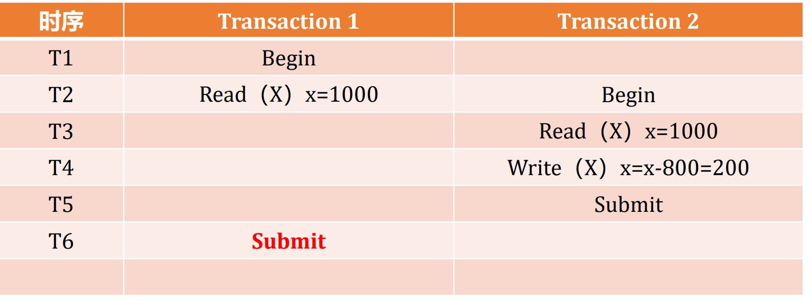
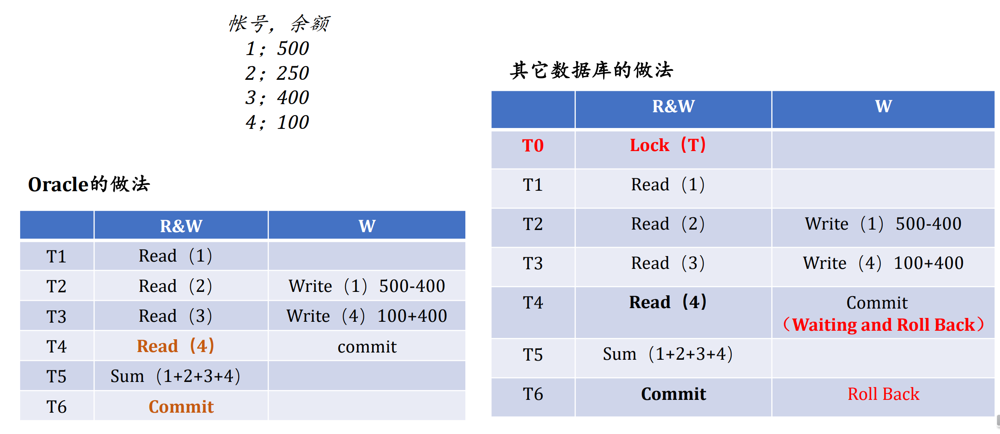
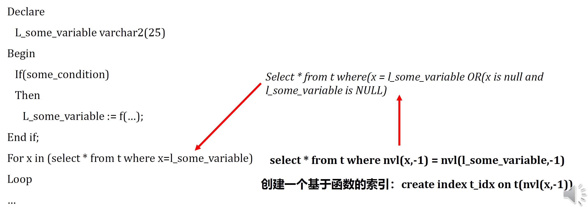
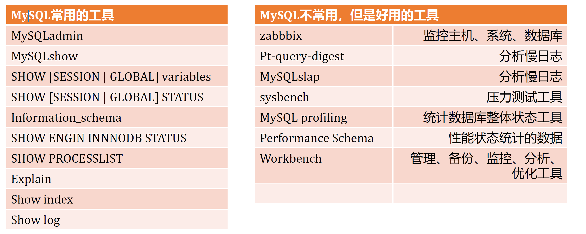
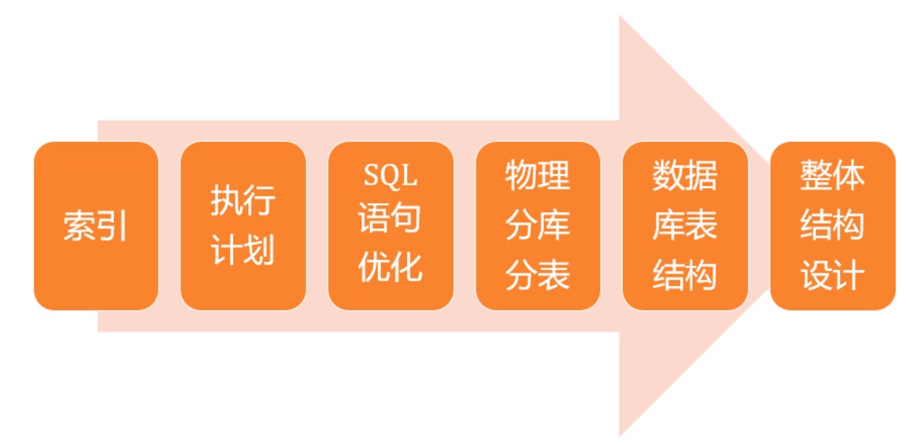

Lec2-开发数据库的要点
---

# 1. 开发成功数据库应用的特点
1. 需要理解数据库体系结构
2. 需要理解锁和并发控制特性：每个数据库都以不同的方式实现
3. 不要把数据库当"黑盒"
4. 性能、安全性都是适当的被设计出来的
5. 用尽可能简单的方法解决问题："创造"永远追不上开发的步伐
6. DBA和RD之间的关系

# 2. 数据库体系结构的差异
1. **不能把数据库当成"黑盒"使用，因为每个数据库都是非常不同的**
2. Oracle和MySQL的差别，类似
   1. Windows和Linux的差别
   2. iOS和Android的差别
   3. 虽然都是DBMS，但它们也有相当的差异
3. 了解这种差异，了解你所使用数据库的特性，是开发成功数据库应用的基础

# 3. 并发控制

## 3.1. 并发控制的问题
1. 现实存在并发，我们需要保持数据的**一致性**，所以要做**并发控制**
2. 锁机制，使得并发控制成为可能
3. **不同的数据库，实现锁机制是不一样的**

## 3.2. 比如：Oracle的锁机制就比较特别
1. 这个时候，Transaction1能提交吗？



## 3.3. Oracle存在有时读不到正确数据的现象
1. Oracle的多版本控制，读一致性的并发模型
   1. 读一致查询：对于一个时间点（point time），查询会产生一致的结果
   2. 非阻塞查询：查询不会被写入器阻塞，**但在其它数据库中可能不是这样的**


## 3.4. Oracle这种锁机制的好处是什么？
1. 例子：ACCOUNTS（account_number, account_balance）一个银行的账户余额,为了简单，只考虑一个仅有四行的表（同时假设每个数据库块中只存放一行数据。）

| 帐号 | 余额 |
| ---- | ---- |
| 1    | 500  |
| 2    | 250  |
| 3    | 400  |
| 4    | 100  |

1. 我们想运行一个日报表，了解银行里有多少钱。下面是一个非常简单的查询：Select sum(account_balance) from accounts;

## 3.5. Oracle和其它数据库在并发上的差别


## 3.6. 从体系结构和特性中了解具体数据库的锁机制
1. 比如Oracle实现的锁机制
   1. 只有修改才加行级锁
   2. Read绝对不会对数据加锁
   3. Writer不会阻塞Reader
   4. 读写器绝对不会阻塞写入器

## 3.7. 课后思考
1. 对大多数码农而言，数据库锁机制好像都是自动和透明实现的，那么深入了解每个数据库的锁机制实现细节，对码农编码有什么影响嘛？
2. 根据这节课Oracle的锁机制特征的分析，你尝试去了解一下MySQL、SQLServer这些其它数据库锁机制实现的特征
3. 请将你的思考和分析，完成课后的小作业（不是两次大作业），优秀的作业会予以表扬或其它奖励

# 4. 程序员的工作

## 4.1. 开发成功数据库应用的要点 -黑盒的问题
> 对大多数码农而言，据库锁机制好像都是自动和透明实现的那么深 入

## 4.2. 问题是：这对我们码农有什么影响吗？
1. Oracle的无阻塞设计有一个副作用，就是如果确实想保证一次只有一个用户访问一行数据，就得开发人员自己做工作。
2. 例如:一个资源调度程序主要有两张表:
   1. `Resources(Resource_name,other_ data)`
   2. `Schedules(resource_ name, start_time, end_time)`
3. 往Schedules中插入一个房间预订之后，提交之前，应用将查询

```sql
Select count(*)
   From schedules
      Where resource_ name =:resource name FOR UPDATE
         and (start_time < :new_end_time) and (end_time > :new_start_time)
```

4. 不能把数据库当成黑盒使用：必须深入了解你所使用的数据库体系结构和特征
5. 什么时候，码农需要自己考虑并发的问题？不知道，看情况

# 5. 黑盒的问题
1. 数据库**黑盒**和**独立性**的问题
2. 数据库的某些细微差异对**开发**造成影响

## 5.1. 黑盒和数据库独立性的问题
1. 数据库有脱离**实现级别**的使用方法
2. 我的观点是
   1. 要构建一个**完全数据库独立**的应用，而且是高度可扩展的应用是**极其困难**的
   2. 实际上，这**几乎是不可能**的
3. 要构建一个完全数据库**独立**的应用
   1. 你必须真正了解每个数据库具体**如何工作**
   2. 如果你清楚每个数据库工作的具体细节，你就会知道，**数据库独立性**可能并不是你真正想要的

## 5.2. 例如：Null值造成的数据库迁移障碍
1. 例子:在表T中，如果不满足某个条件，则找出X为NULL的所有行，如果满足就找出X等于某个特定值的所有行。



## 5.3. 关于黑盒的问题总结几点
1. 数据库是不同的。在一个数据库上取得的经验也许可以部分应用于另一个数据库，但是必须有心理准备，二者之间可能存在一些基本差别，可能还有一些细微的差别。
2. 细微的差别(比如对NULL的处理)与基本差别(如并发控制机制)可能有同样显著的影响。
3. 应当了解数据库，知道它是如何工作的，他的特性如何实现，这是解决这些问题的唯一途径。

## 5.4. 思考题
1. 关于把数据库当成黑盒使用的错误，其实也会在你学习软件开发中遇到类似
的问题，比如，对操作系统的黑盒化，比如对某些开发框架的黑盒化等等,
请你思考一下，你的学习过程中，还能找到类似的例子嘛?

# 6. 设计的问题

## 6.1. 我能不能找一个大牛帮我调优
1. 先把程序写出来，之后再让专家在生产环境中帮我**调优**：这个想法是错误的.
2. **性能调优**(目前情况下性能优化至最优)
   1. 根据当前CPU能力、可用内存、I/O子系统等资源情况来设置相应参数
   2. 通过索引、物理结构、SQL的优化，具体提高某一个查询的性能
3. 如果有个专家能通过一些参数、技巧提高了你的系统一个数量级的性能：不能说这个专家牛逼，大概只能说明你的程序太烂了。

## 6.2. 性能拙劣的罪魁祸首是错误设计
1. **提高整体性能**
   1. 技巧决定系统性能的下限
   2. 设计决定系统性能的上限
2. 比如，新闻的门户网站
   1. 动态页面 vs 静态页面
   2. 静态页面 + 内容管理系统

## 6.3. 性能优化要考虑整体
1. 性能指标都是有**成本**的、**安全和优化**中寻找平衡
2. 性能指标以**吞吐量**为核心(每秒处理多少事务)，而尽量不用一个事务几秒能处理完成
3. 性能指标要考虑**整体性**
   1. 优化手段本身就有很大的风险，只不过你没意识到罢了
   2. 任何一个技术可以解决一个问题，但必然存在另一个问题的风险
   3. 对于带来的风险，控制在可接受的范围才是有成果
   4. 性能优化技术，使得性能变好，维持和变差是等概率的事件

## 6.4. 使用优化工具


## 6.5. 整体层面的性能优化考虑
1. 问题一: CPU负载高, IO负载低
   1. 内存不够
   2. 磁盘性能差(磁盘问题、raid设计不好、 raid降级)
   3. **SQL的问题**
   4. **并发锁机制的问题**
   5. **事务设计问题，大量小数据IO**
   6. **大量的全表扫描**
2. 问题二:IO负载高，CPU负载低
   1. **大量小的IO执行写操作**
   2. **Autocommit,产生大量小IO**
   3. **大量大的IO执行写操作**
   4. **SQL的问题**
   5. IO/PS磁盘限定一个每秒最大IO次数
3. 问题三: IO和CPU负载都高
   1. 硬件不够用了
   2. SQL存在问题
   3. 性能问题，90%的问题来源都是程序员的问题，开发环境到生产环境是一场灾难

## 6.6. SQL优化的方向


## 6.7. 思考
1. 你对你常用的关系数据库关系系统中，去寻找一些针对优化的工具，去尝试使用一些性能的分析和监控I具(查看数据库官方Reference，首先使用官方的命令和工具)
