Lec4-SQL优化
---

# 1. SQL优化

## 1.1. 关系代数
1. E.FCodd关系理论之父，关系代数究竟有什么用?
2. 代数是表达式的等价变换

$$
\begin{aligned}
(2 + 4) \times 3 &=  6 \times 3  &= 18 \\
  &=(2 + 2 + 2) \times 3\\
  &=2 \times 3 + 4 \times 3 \\
  &=2 \times 3 + (2 + 2) \times 3 \\
\end{aligned}
$$

3. 关系代数也是一样
   1. 2、3、4 这些数字对应的就是 **关系（表）**
   2. +-×/ 这些运算符对应的就是 **关系操作**
4. 如果将所有的路径全部遍历完会有比较大的代价，同时还要对知识、应用环境的现在、未来、时间空间分布有了解。


## 1.2. 关系代数使数据库变成了科学而不是艺术
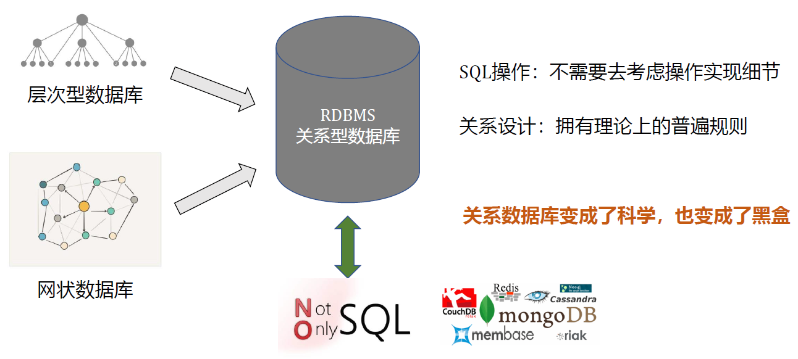

查询优化器完成具体查询的优化 

## 1.3. SQL与查询优化器


1. 优化器借助关系理论提供的语义无误的原始查询进行**有效的等价变换**，优化在**发生查询**的时候才发生。
2. 优化器根据数据库的实际实现情况对理论上等价的不同优化方案做出**权衡**
3. 产生可能的最优查询执行方案
4. 排序、统计等不是在关系代数中完成的，而是在SQL中完成的。

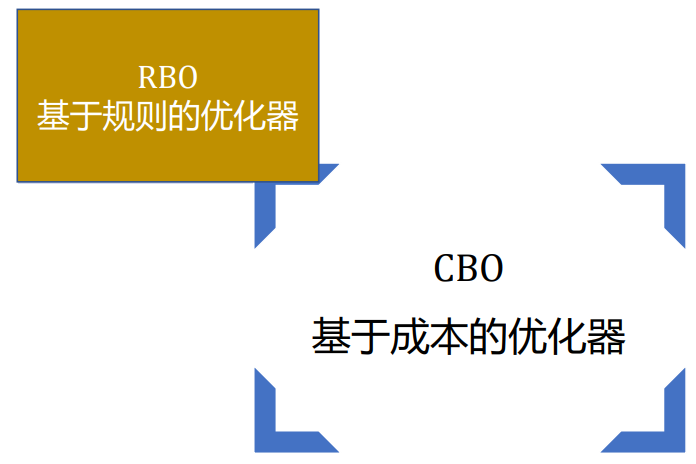

## 1.4. SQL的执行顺序
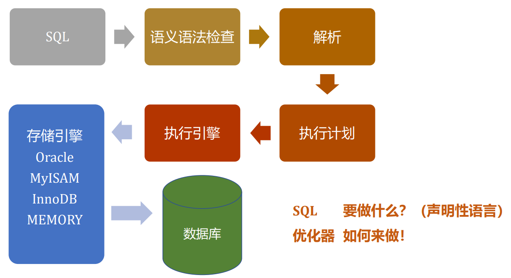

1. SQL语句首先通过语义和语法检查，进入查询环节，进行解析，是整个SQL优化最消耗资源的环节。
2. 之后对于每一个表达式的等价变化生成解析树，然后进行评估。由优化器选择一个最满意的执行路径来生成执行计划(plan和二进制的执行代码)
3. 将执行计划导入到执行引擎后在数据库中进行查询。
   1. 查询优化器不能检查SQL本身的错误
   2. 查询优化器不能优化中间结果集
4. 软解析的问题：目前主流的还是采用硬解析的方式，尽量避免出现SQL注入的问题


## 1.6. 优化器只能对关系领域进行优化
1. 忽略这点很可能出现错误
2. 例子：查询不是经理的员工当中，哪五个人收入最高？注意order by的问题 

```sql
// 错误的    会先截取前5行，再排序
select empname, salary
  from employees
    where status != 'EXECUTIVE'
    and rownum <= 5
    order by salary desc
// 正确的    先得到排序后的结果，再截取前5行
select *
  from (select empname, salary
    from employees
    where status != 'EXECUTIVE'
    order by salary desc)
  where rownum <= 5
```

## 1.7. 优化器的有效范围
1. 优化器需要借助数据库中找到的信息
2. 能够进行数学意义上的等价变换
3. 优化器考虑整体响应时间：复杂查询可能无法优化的很好
4. 优化器改善的是独立的查询

## 1.8. 思考题
1. Oracle的rownum是一个非常讨厌的SQL方言，但它是Oracle数据库中唯一的限定返回行数的函数，其它数据库也有类似的方言
   1. DB2使用FETCH FIRST子句
   2. MySQL和PostgreSQL使用LIMIT子句
   3. SQL Server使用TOP关键字
   4. 请你用你手上常用的数据库试一下本课程那个限定返回行数查询的例子，看看有没有Oracle出现的问题
   5. 如果你是用Oracle，你试一下，你能通过rownum=5，来返回第5行记录嘛？

# 2. 使用SQL需要考虑的因素
1. 获得结果集所需访问的数据量
2. 定义结果集所需的查询条件
3. 结果集的大小
4. 获得结果集所涉及的表的数量
5. 同时修改这些数据用户的多少

## 2.1. 数据总量
1. SQL考虑最重要因素：**必须访问的数据总量**
2. **没有确定目标容量之前，很难断定查询执行的效率**

## 2.2. 定义结果集的查询条件
1. Where子句，特别在子查询或视图中可能有多个where子句
2. **过滤条件的效率有高有低，受到其他因素的影响很大**
3. 影响因素：过滤条件、主要SQL语句、庞大的数据量对查询的影响
   1. 对于过滤条件而言，我们需要考虑两个条件：一个是80%的行满足，一个是10%的行满足，那么我们先做哪个，那么肯定优先是第二个的
   2. 分页拆分是很好的方法

## 2.3. 结果集的大小
1. 查询所返回的数据量，重要而被忽略：考虑用户体验，比如2s的查询后没有结果
2. 取决于表的大小和过滤条件的细节
3. 例外是若干个独立使用效率不高的条件结合起来效率非常高
4. 从技术角度来看，查询结果集的大小并不重要，重要的是用户的感觉
5. 熟练的开发者应该努力使响应时间与返回的记录数成比例

## 2.4. 表的数量
1. 表的数量会对性能有影响
2. 表的join连接
   1. （太）多表连接该质疑设计的正确性了
   2. 对于优化器，随着表数量的增加，复杂度将呈指数增长。
   3. 编写（太）多表的复杂查询时，多种方式连接的选择失误的几率很高
   4. 代码表：往往是供查询和下拉菜单的
   5. 对于有多个外键的表，不存储eid，而选择名称之类的，但是容易导致不一致性问题，这就意味着我们不能允许用户自由输入而是通过选择的方式输入。
3. 还有一个容易忽视的问题，复杂查询和复杂视图：基本的原则是，当是视图返回的数据远多于上级查询所需要的时候，就放弃使用该视图
4. 能不使用视图就不使用视图，视图会屏蔽很多优化细节

## 2.5. 并发用户数
1. 设计的时候需要注意
   1. 数据块访问争用（block-access contention）
   2. 阻塞(locking)
   3. 闩定(latching)
   4. 保证读取一致性(read consistency)
2. 一般而言，整体吞吐量>个体响应时间

## 2.6. 思考题
1. 你还有什么方法（自己遇到的，或者查询技术资料、论坛等等资源）能够在数据库应用方面，照顾好用户的情绪？欢迎你的分享。

# 3. SQL过滤的条件

## 3.1. 查询的过滤条件
1. 如何限定结果集是最为关键的因素
2. 也是使用SQL各种技巧的判断因素

## 3.2. 过滤条件的含义
1. Where子句和having子
   1. Join过滤条件
   2. Select过滤条件

```sql
select
  from t1
    inner join t2
      on t1.join1 = t2.join2
where ...
  # 如果存在t1.c2>100这个条件放哪里？
```

2. 假设有一个参数表 p（pname，ptype，pvalue）无论ptype定义了什么参数属性，pvalue都是用字符串表示（请记住这是一个错误的用法）

```sql
select * from p
where pname like '%size'
  and ptype = 'NUMBER'
  and int(pvalue) > 1000
```

## 3.3. 过滤条件的好坏
1. 最终需要的数据是什么，来自哪些表
2. 哪些输入值会传递到DBMS引擎
3. 能过滤掉不想要的数据的条件有哪些
4. 高效过滤条件是查询的主要驱动力

## 3.4. 来，去买BMW


1. 找出最近6个月住在nanjing，购买了BMW的所有客户
2. 按照下面的方式先连接再使用条件查询的方式会避免遗漏

```sql
select distinct c.custname
  from customers c
    join orders o
      on o.custid = c.custid
    join orderdetail od
      on od.ordid = o.ordid
    join articles a
      on a.artid = od.artid
  where c.city = 'Nanjing'
    and a.artname = 'BMW'
    and o.ordered >= somefunc /*函数，返回六个月前的具体日期*/
```

2. 古老的自然连接方式：性能会很差(系统不会很复杂)，避免在最高层出现distinct

```sql
select distinct c.custname
  from customers c,
    orders o,
    orderdetail od,
    articles a
  where c.city = 'Nanjing'
    and c.custid = o.custid
    and o.ordid = od.ordid
    and od.artid = a.artid
    and a.artname = 'BMW'
    and o.ordered >= somefunc
```

## 3.5. 进一步
1. 避免在最高层distinct应该是一条基本规则
   1. 发现重复数据容易，发现不准确的连接难
   2. 发现结果不正确就更难了

## 3.6. 摆脱distinct的方法
1. 客户在Nanjing市，而且满足Exists存在性测试即在最近六个月买了BMW

```sql
select c.custname
  from customers c
  where c.city = 'Nanjing'
    and exists (select null
      from orders o,
        orderdetail od,
        articles a
      where a.artname = 'BMW'
        and a.artid = od.artid
        and od.ordid = o.ordid
        and o.custid = c.custid /* Exists嵌套子查询和外层select关系非常密切 */
        and o.ordered >= somefunc )
```

## 3.7. 非关联子查询
```sql
select custname
from customers
where city = 'Nanjing'
  and custid in (select o.custid
    from orders o,
      orderdetail od,
      articles a
    where a.artname = 'BMW'
      and a.artid = od.artid
      and od.ordid = o.ordid
      and o.ordered >= somefunc)
```

1. 关联子查询中，orders表中custid字段要有索引，而对非关联子查询则不需要，因为要用到的索引是customers的主键索引
2. 内层查询不再依赖外层查询，只需要执行一次
3. 如果外层的条件好就用exists，他会暗示优化器先做外层的查询，内层条件好就用in。in会隐式地消除重复项。

## 3.8. 还可以进一步嵌套
1. exists -> ordid in

```sql
select custname
  from customers
  where city = 'NanJing'
    and custid in
      (select o.custid
      from orders o
      where o.ordered >= somefunc
        and exists (select null
          from orderdetail od,
            articles a
          where a.artname = 'BMW'
            and a.artid = od.artid
            and od.ordid = o.ordid))
select custname
  from customers
  where city = 'NanJing'
    and custid in
      (select custid
      from orders
      where ordered >= somefunc
        and ordid in (select od.ordid
          from orderdetail od,
            articles a
          where a.artname = 'BMW'
            and a.artid = od.artid)
```

## 3.9. 还没看够不同的SQL写法嘛？
1. 对于很多数据库来说，非关联子查询还可以写成from子句的内嵌视图

```sql
select custname
  from customers
  where city = 'Nanjing'
    and custid in
      (select o.custid
      from orders o,
        (select distinct od.ordid
        from orderdetail od,
          articles a
        where a.artname = 'BMW'
          and a.artid = od.artid) x
      where o.ordered >= somefunc
        and x.ordid = o.ordid)
```

## 3.10. 跟我去买BMW例子的总结
1. 找到分辨率最强的条件
   1. 解决方案不止一种，查询和数据隐含的假设密切相关
   2. 预先考虑优化器的工作，以确定它能找到所需要的数据


## 3.11. 多表关联的不同优化器的策略
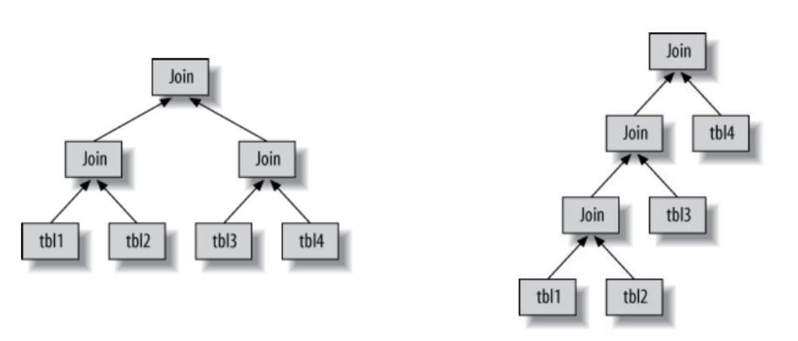

## 3.12. 思考题
1. 你可以比较两个查询，在MySQL的Sakila示例数据库中分析不同查询的差异

```sql
# 1
SELECT DISTINCT film.film_id
FROM sakila.film
  INNER JOIN sakila.film_actor USING(film_id);

# 2
SELECT film_id
FROM sakila.film
WHERE EXISTS(
  SELECT * FROM sakila.film_actor
    WHERE film.film_id = film_actor.film_id);
```

2. 使用EXPLAIN命令查询执行计划和执行时间，分析一下性能差异的原因

# 4. 改写SQL降低表连接

## 4.1. where子句的比较运算符
1. select中的函数只计算一次，而where中的函数要计算多次
```
(1) a = 1000
(2) a = 500 + 500 CBO只能将(2)自动转化成(1)，无法改变(3)，这是f()
(3) a – 500 = 500 在全表扫描的时候，(2)(1)是一个比较操作，(3)是一个减法操作
```

2. 请看下面这个例子，分析3条SQL语句的差别

```sql
create table t as select x from dba_objects;
insert into t select * from t;
```

3. 创建一个40万+的表
4. 统计3条SQL语句的差别，都是统计2019年4月20日这一天每个用户下的对象的个数
5. 数据库底层文件堆文件，按块存储，一个块默认4K大小，如果本块的最后一条数据中，如果变长导致超出块长度则将这个记录的部分放在下一个块中(再存储一个链接)，这种情况叫做行迁移。
   1. 数据一般只允许一次行迁移
   2. 如果要发生第二次行迁移，则将这条记录存放到单独的块中
3. 下列的二使用不到索引，导致每一条要执行一次函数计算
4. 下列的三使用不到索引，导致每一条要执行两次函数计算
5. 慢查询和快查询：需要有大量的操作的情况下才会感受到
6. 慢查询会拖累同系统内的快查询

```sql
/* 1 √ */
set time on
select count(*) from t
where cteated>=to_date('2019-04-20 00:00:00','yyyy-mm-dd hh24:mi:ss')
  and created<to_date('2019-04-21 00:00:00','yyyy-mm-dd hh24:mi:ss')
group by owner;
/* 2 × */
select count(*) from t
where to_char(created,'yyyy-mm-dd')='2019-04-20'
group by owner;
/* 3 × */
select count(*) from t
where to_char(created,'yyyy-mm-dd hh24:mi:ss')>='2019-04-20 00:00:00'
  and to_char(created,,'yyyy-mm-dd hh24:mi:ss')<= '2019-04-20 23:59:59'
group by owner
```

## 4.2. 比较运算符的转化


## 4.3. 大数据量查询
1. 越快剔除不需要的数据，查询的后续阶段必须处理的数据量就越少，查询效率就越高

```sql
Select …
From A, B, C , D, E1
Where (condition on E1)
  and (join and other conditions)
Union
Select …
From A,B,C,D,E2
Where (condition on E2)
  and (join and other conditions)

/* 更新为 */
Select…
From A,B,C,D,
  (select …
    from E1
    where (condition on E1)
  union
  select…
    from E2
    where (condition on E2)
  ) E
Where (joins and other conditions)
```

## 4.4. 将子查询转换为JOIN
1. 不包含聚合函数，不出现多种条件选择可以不需要子查询 。如果有过滤条件好坏以及最高层的distinct可以用子查询，其他没有特殊情况可以将选择权交给优化器。
2. Jobs(employee，title) Ranks(title，rank)Salary(rank，payment)

```sql
Select payment from salary where rank=
  (select rank from ranks where title=
    (select title from jobs where employee = '…'))

/* 修改为 */
Select payment from salary, ranks,jobs
  Where salary.rank = ranks.rank
    And ranks.title = jobs.title
    And jobs.employee = '…'
```

## 4.5. 查询不存在的内容(左右连接)
1. 在salary表中查询是否存在某个等级当前没有分配职位，显示等级和薪水
2. Jobs(employee，title) Ranks(title，rank)Salary(rank，payment)
3. 第一种性能很差，要建立rank的临时表，外键索引无法使用，需要全表遍历。查找表中不匹配的行，应该用外连接outer join。

```sql
Select salary.ranks salary.payment from salary
Where rank NOT IN (select rank from ranks)

/* 修改为 */
Select salary.ranks salary.payment
From salary
  LEFT OUTER JOIN ON(salary.rank = ranks.rank)
Where ranks.rank IS NULL
```

## 4.6. 将聚合子查询转换为JOIN或内嵌视图
1. 在订单完成前有不同状态，记录在orderstatus（ordid,status,statusdate）中，主键(ordid,statusdate)
2. 需求是：列出所有尚未标记为完成状态的订单的下列字段：订单号，客户名，订单的最后状态，以及设置状态的时间。
3. 过滤分组字段或聚合结果，在group by之后过滤having，和聚合无关的操作放在where中

## 4.7. 再回头看订单和客户的例子

1. 需求是：列出所有尚未标记为完成状态的订单的下列字段：订单号，客户名，订单的最后状态，以及设置状态的时间

```sql
//版本1，两个子查询访问了相同的表，orderstatus被遍历了三次
select c.custname, o.ordid, os.status, os.statusdate
  from customers c,
    orders o,
    orderstatus os
  where o.ordid = os.ordid
    and not exists (select null    //找到未完成的
      from orderstatus os2
      where os2.status = 'COMPLETE'
      and os2.ordid = o.ordid)
    and os.statusdate = (select max(statusdate)  //找到最后的时间
      from orderstatus os3
      where os3.ordid = o.ordid)
    and o.custid = c.custid

//版本2，重写之后的子查询
select c.custname, o.ordid, os.status, os.statusdate
  from customers c,
    orders o,
    orderstatus os
  where o.ordid = os.ordid
    and not exists (select null    //找到未完成的
      from orderstatus os2
      where os2.status = 'COMPLETE'
      and os2.ordid = o.ordid)
    and (o.ordid, os.statusdate) = (select ordid, max(statusdate) //左边的字段对比较别扭，优化器可能将两张表连在一起
      from orderstatus
      group by ordid)
    and o.custid = c.custid
    

//这样写先子查询再连接
    and (os.ordid, os.statusdate) 
```

## 4.8. 非关联子查询变成内嵌视图
```sql
//版本3，内嵌视图
select c.custname, o.ordid, os.status, os.statusdate
  from customers c,
    orders o,
    orderstatus os,
    (select ordid, max(statusdate) laststatusdate    //增加内嵌视图x，不会瞎连接了
    from orderstatus
    group by ordid) x
  where o.ordid = os.ordid
    and not exists (select null       //没有必要了
      from orderstatus os2
      where os2.status = 'COMPLETE'
      and os2.ordid = o.ordid)
    and os.statusdate = x.laststatusdate
    and os.ordid = x.ordid
    and o.custid = c.custid

//版本4，完美完成了需求，虽然要全表遍历，但是减少了链接，一般情况下性能好很多
select c.custname, o.ordid, os.status, os.statusdate
  from customers c,
    orders o,
    orderstatus os,
    (select ordid, max(statusdate) laststatusdate
    from orderstatus
    group by ordid) x
  where o.ordid = os.ordid
    and os.statusdate = x.laststatusdate
    and os.ordid = x.ordid
    and os.status != 'COMPLETE'  //不需要exists
    and o.custid = c.custid
```

内嵌视图对orderstatus进行了全表遍历，但也减少了一次连接操作，一般情况下是有利的。

如果仍然有性能问题，从根本上解决问题，可以在orders表中加一个冗余字段记录最新状态，每次更新orderstatus表的时候通过触发器更新。

用户有多个地址，需要一个表address记录用户id和地址，搜索用户地址要做表连接。网站会使用缺省地址，在customer表中记录，这样在订单界面就不需要链接地址表，只有在更改地址的时候需要连接，可以大幅提升系统的吞吐量。

但是维护成本也上升了，需要维护触发器，取决于数据更新频率。

还有一个办法，查询的时候加一个时间限定。未完成的订单一般是最近一个月的，建立时间的索引，只返回最近一个月的订单，用户有需要再返回更早的订单。

## 4.9. 思考题

1. Orders(custid，ordered，totalitems)
2. 需要显示每一个客户购物件数最多的日期，如何用连接改写这个SQL的子查询

```sql
Select custid, ordered, totalitems
From orders o1
Where o1.ordered = (
  select max(ordered)
  from orders o2
  where o1.custid = o2.custid)
```

# 5. SQL的主题

## 5.1. 字符串处理
1. 遍历字符串
2. 嵌入引号
3. 统计字符出现的次数
4. 删除不想要的字符
5. 分离数字和字符数据
6. 判断含有字母和数字的字符串
7. 提取姓名的首字母

## 5.2. SQL的字符串处理
1. SQL并不专门用于处理复杂的字符串
   1. 很多时候非常麻烦，令人沮丧
   2. BUT，仍然有很多很好用的内置函数
2. 任何事物，包括SQL都有自己好的一面和坏的令人厌恶的一面

### 5.2.1. 遍历字符串
1. 这是一切字符串处理的基础，你需要有逐字遍历字符串的能力
2. SQL没有Loop循环功能，我们需要有**数据透视表**(T1，T10，T100...)   t10是包含一列id 范围1到10的表
3. 问题：把EMP表中的ENAME=KING的字符串拆开显示为4行，每行一个字符

```sql
1 select substr(e.ename,iter.pos,1) as C
2   from (select ename from emp where ename = 'KING') e,
3   (select id as pos from t10) iter
4 where iter.pos <= length(e.ename)
```

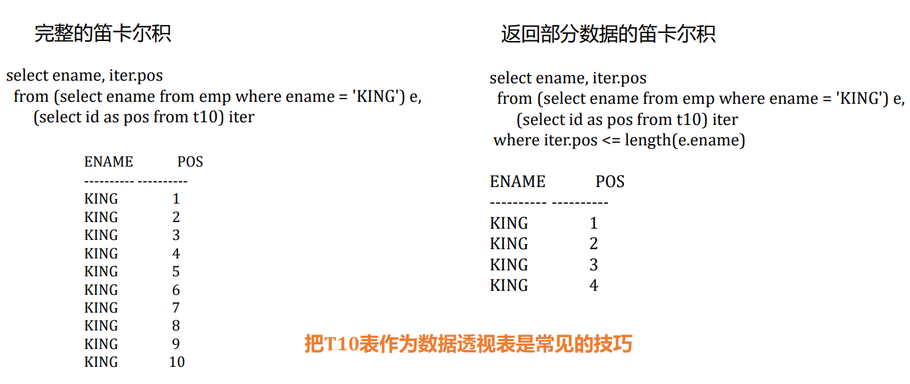


### 5.2.2. 嵌入引号
1. 如果想在字符串常量中嵌入引号，并且希望使用SQL产生如下所示的结果 双引号显示为一个引号

```sql
1 select 'g''day mate' qmarks from t1 union all
2 select 'beavers'' teeth' from t1 union all
3 select '''' from t1
```

### 5.2.3. 统计字符出现的次数
1. 问题：统计字符串中有多少个逗号？10,CLARK,MANAGER


```sql
1 select (length('10,CLARK,MANAGER')-
2   length(replace('10,CLARK,MANAGER',',','')))/length(',')
3   as cnt
4 from t1
```

2. 问题：如何统计HELLO HELLO中出现了多少个LL

```sql
select
  (length('HELLO HELLO')-
  length(replace('HELLO HELLO','LL','')))/length('LL')
  as correct_cnt,
  (length('HELLO HELLO')-
  length(replace('HELLO HELLO','LL',''))) as incorrect_cnt
from t1
```


3. 除法运算是得到“次数”这类运算正确答案必须使用的运算手段

### 5.2.4. 删除不想要的字符
1. 问题：从数据里删除指定的字符，从左边的结果集中的数据里删除所有的0和元音字母，并将删除后的值显示在STRIPPED1列和STRIPPED2列中，形成右边的结果集形态

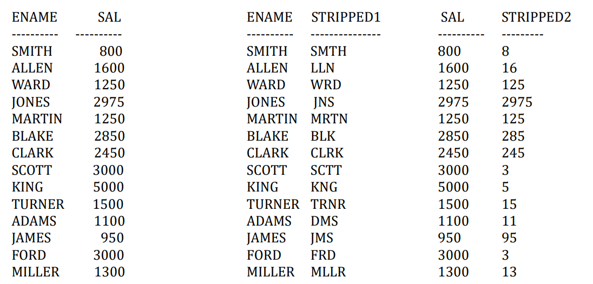

2. 先用TRANSLATE函数把元音字母替换成一个特殊的字符，然后使用REPLACE函数删除这个特殊字符

```sql
/* Oracle and PostgreSQL */
1 select ename,
2     replace(translate(ename,'AEIOU','aaaaa'),'a')
3     as stripped1,
4     sal,
5   replace(sal,0,'') as stripped2
6 from emp
```

2. 没有TRANSLATE函数，那就只有做苦力活了

```sql
/* MySQL and SQL Server */
1   select ename,
2     replace(
3     replace(
4     replace(
5     replace(
6     replace(ename,'A',''),'E',''),'I',''),'O',''),'U','')
7     as stripped1,
8     sal,
9     replace(sal,0,'') stripped2
10  from emp
```

### 5.2.5. 分离数字和字符数据
1. 问题：把数据中的数字数据和字符数据分开，怎么办？

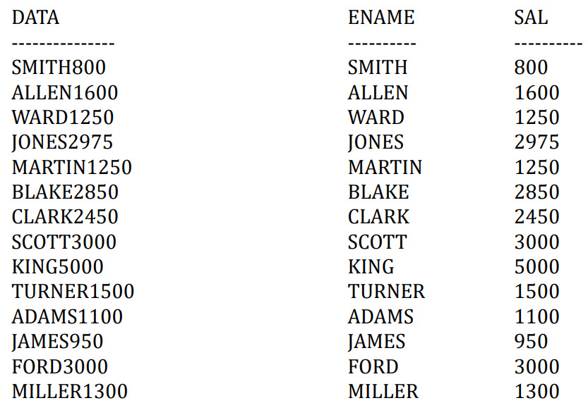

2. MySQL只用REPLACE怎么办？

```sql
/* Oracle */
1 select replace(
2   translate(data,'0123456789','0000000000'),'0') ename,
3   to_number(
5     replace(
6     translate(lower(data),
7       'abcdefghijklmnopqrstuvwxyz',
8       rpad('z',26,'z')),'z')) sal
9   from (
10    select ename||sal data
11    from emp
12  )
```

### 5.2.6. 判断含有字母和数字的字符
1. 问题：从表里筛选出部分行数据，筛选条件是只包含字母和数字字符
2. 视图V

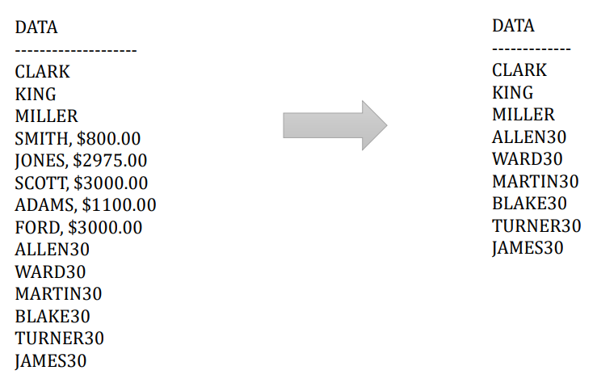

```sql
/* MySQL */
1 select data
2   from V
3 where data regexp '[^0-9a-zA-Z]' = 0
/* Oracle */
1 select data
2   from V
3 where translate(lower(data), '0123456789abcdefghijklmnopqrstuvwxyz',rpad('a',36,'a'))
4     = rpad('a',length(data),'a')
```

### 5.2.7. 提取姓名的首字母
1. 问题：你想把姓名变成首字母形式，比如LeBron James, 就可以变成L.J.

```sql
/* MySQL */
1   select case
2     when cnt = 2 then
3       trim(trailing '.' from
4         concat_ws('.',
5         substr(substring_index(name,' ',1),1,1),
6         substr(name,
7           length(substring_index(name,' ',1))+2,1),
8         substr(substring_index(name,' ',-1),1,1),
9         '.'))
10      else
11        trim(trailing '.' from
12          concat_ws('.',
13          substr(substring_index(name,' ',1),1,1),
14          substr(substring_index(name,' ',-1),1,1)
15          ))
16      end as initials
17    from (
18      select name,length(name)-length(replace(name,' ','')) as cnt
19        from (
20          select replace('Stewie Griffin','.','') as name from t1
21        ) y
22    ) x

/* Oracle and PostgreSQL */
1 select replace(
2   replace(
3   translate(replace('Stewie Griffin', '.', ''),
4     'abcdefghijklmnopqrstuvwxyz',
5     rpad('#',26,'#') ), '#','' ),' ','.' ) ||'.'
6 from t1
```

### 5.2.8. 还有些字符串操作比较复杂
1. 创建分隔列表、字段内部排序、解析IP地址等等
2. 但一般很少使用，我们可以通过更好的设计避免出现这样的问题
3. 但，SQL处理字符串的能力是非常弱小的，每个数据库都有自己的内置函数，且无法通用

### 5.2.9. 思考题
1. 把行数据变成以某种符号分割符的列表，比如逗号
2. 可以使用聚合函数完成的业务都不要到业务逻辑(前端和后端)来处理
3. MySQL的GROUP_CONCAT


## 5.3. 数值处理

### 5.3.1. 示例使用的相关表和数据
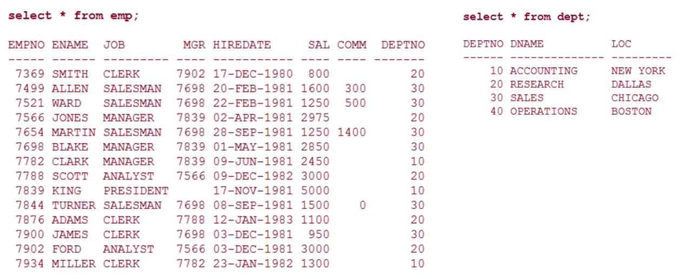

### 5.3.2. 计算平均值
```sql
1 select avg(sal) as avg_sal
2   from emp

AVG_SAL
----------
2073.21429
```

- 遇到空值怎么办？直接忽略空值
- 如果需要统计空值？

```sql
create table t2(sal integer)
insert into t2 values (10)
insert into t2 values (20)
insert into t2 values (null)
```

```sql
select avg(sal)
  from t2

AVG(SAL)
----------
15
```

```sql
select avg(coalesce(sal,0))
  from t2

AVG(COALESCE(SAL,0))
--------------------
10
```

```sql
1 select deptno, avg(sal) as avg_sal
2   from emp
3   group by deptno

DEPTNO        AVG_SAL
-----------   ----------------
10            2916.66667
20            2175
30            1566.66667
```

```sql
1 select avg(sal)
2   from emp
3 group by deptno

AVG(SAL)
----------------
2916.66667
2175
1566.66667
```

### 5.3.3. 查找最大值和最小值
```sql
1 select min(sal) as min_sal, max(sal) as max_sal
2   from emp

MIN_SAL       MAX_SAL
------------ --------------
800           5000

1 select deptno, min(sal) as min_sal, max(sal) as max_sal
2   from emp
3 group by deptno

DEPTNO        MIN_SAL         MAX_SAL
------------  --------------  ------------
10            1300            5000
20            800             3000
30            950             2850
```

### 5.3.4. 求和
```sql
1 select sum(sal)
2   from emp

SUM(SAL)
----------
29025

1 select deptno, sum(sal) as total_for_dept
2   from emp
3 group by deptno

DEPTNO      TOTAL_FOR_DEPT
----------  --------------
10          8750
20          10875
30          9400
```

### 5.3.5. 计算行数
```sql
1 select count(*)
2   from emp

COUNT(*)
--------
14
```

```sql
1 select deptno, count(*)
2   from emp
3 group by deptno

DEPTNO      COUNT(*)
----------  ----------
10          3
20          5
30          6
```

- 计算某一列的非空个数

```sql
select count(comm)
  from emp

COUNT(COMM)
-----------
4
```

### 5.3.6. 累计求和(Running Total)
```sql
/* Oracle and DB2(MySQL已经支持了) */
1 select ename, sal,
2   sum(sal) over (order by sal,empno)
3     as running_total
4 from emp
5 order by 2
```

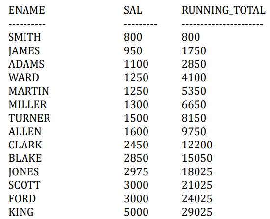

```sql
/* MySQL and PostgreSQL and SQL Server */
1 select e.ename, e.sal,
2   (select sum(d.sal) from emp d
3   where d.empno <= e.empno) as running_total
4  from emp e
5 order by 3
```


### 5.3.7. 计算众数
```sql
select sal
    from emp
  where deptno = 20
    order by sal

SAL
----------
800
1100
2975
3000
3000
```

```sql
/* Oracle */

1 select max(sal)
2     keep(dense_rank first order by cnt desc) sal
3   from (
4     select sal, count(*) cnt
5       from emp
6       where deptno=20
7       group by sal
8   )

/* MySQL and PostgreSQL */
1 select sal
2   from emp
3 where deptno = 20
4 group by sal
5 having count(*) >= all ( select count(*)
6                           from emp
7                           where deptno = 20
8                           group by sal )
```

### 5.3.8. 计算中位数
```sql
select sal
  from emp
  where deptno = 20
  order by sal

SAL
----------
800
1100
2975
3000
3000
```

```sql
/* MySQL and PostgreSQL */
1 select avg(sal)
2   from (
3     select e.sal
4       from emp e, emp d
5     where e.deptno = d.deptno
6       and e.deptno = 20
7     group by e.sal
8     having sum(case when e.sal = d.sal then 1 else 0 end)
9             >= abs(sum(sign(e.sal - d.sal)))
10  ) x

/* Oracle */
1 select median(sal)
2   from emp
3 where deptno=20
```

- 表的自连接是很重要的一种手段

### 5.3.9. 计算百分比
```sql
/* MySQL and PostgreSQL */
1 select (sum(
2   case when deptno = 10 then sal end)/sum(sal)
3   )*100 as pct
4 from emp
/* DB2, Oracle, and SQL Server */
1 select distinct (d10/total)*100 as pct
2   from (
3     select deptno,
4       sum(sal)over( ) total,
5       sum(sal)over(partition by deptno) d10
6     from emp
7   ) x
8 where deptno=10
```

### 5.3.10. 计算平均值时去掉最大值和最小值
```sql
/* MySQL and PostgreSQL */
1 select avg(sal)
2   from emp
3 where sal not in (
4   (select min(sal) from emp),
5   (select max(sal) from emp)
6 )

/* DB2, Oracle, and SQL Server
 */
1 select avg(sal)
2   from (
3     select sal, min(sal)over() min_sal, max(sal)over() max_sal
4   from emp
5   ) x
6 where sal not in (min_sal,max_sal)
```

### 5.3.11. 修改累计值
1. 问题，你想依据另一列的值来修改累计值。有这样一个场景，你希望显示一个信用卡账户的交易历史，并显示每一笔交易完成后的余额。

```sql
create view V (id,amt,trx)
  as
  select 1, 100, 'PR' from t1 union all
  select 2, 100, 'PR' from t1 union all
  select 3, 50, 'PY' from t1 union all
  select 4, 100, 'PR' from t1 union all
  select 5, 200, 'PY' from t1 union all
  select 6, 50, 'PY' from t1
```

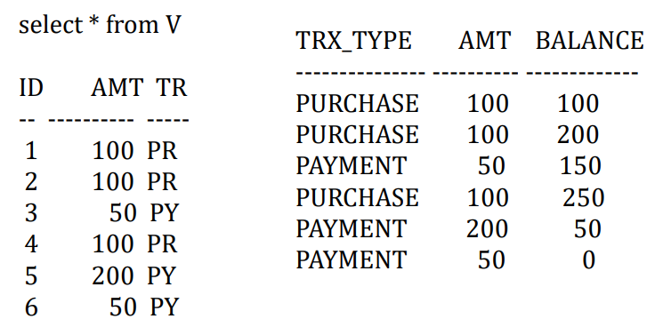

```sql
/* DB2 and Oracle */
1   select case when trx = 'PY'
2         then 'PAYMENT'
3         else 'PURCHASE'
4       end trx_type,
5       amt,
6       sum(
7         case when trx = 'PY'
8           then -amt else amt
9       end
10      ) over (order by id,amt) as balance
11 from V

/* MySQL, PostgreSQL, and SQL Server */
1 select case when v1.trx = 'PY'
2 then 'PAYMENT'
3 else 'PURCHASE'
4 end as trx_type,
5 v1.amt,
6 (select sum(
7 case when v2.trx = 'PY'
8 then -v2.amt else v2.amt
9 end
10 )
11 from V v2
12 where v2.id <= v1.id) as balance
13 from V v1
```

### 5.3.12. 思考题
1. 2.5是进行累加，你看看怎么做累计乘法，和累计减法。
2. 如果有时间，希望你把这一讲中所有的例子在你的数据库中尝试一下
3. 如果你还有时间，创建大一点的表，100万行，然后执行查询100次，1000次或者100个并发同时执行，就可以感受到性能和效率
4. 尝试将读写分离来提高资源：可以先离线计算出一个中位数(但是不是完全正确，但是已经相当精确)

## 5.4. 日期处理

### 5.4.1. 年月日加减法
1. 问题，以员工CLARK的hiredate为例，计算入职的前后五天，入职的前后五个月，以及入职前后5年的日期，hiredate='09-JUN-1981'

```sql
/* Oracle */
1 select  hiredate-5                  as hd_minus_5D,
2         hiredate+5                  as hd_plus_5D,
3         add_months(hiredate,-5)     as hd_minus_5M,
4         add_months(hiredate,5)      as hd_plus_5M,
5         add_months(hiredate,-5*12)  as hd_minus_5Y,
6         add_months(hiredate,5*12)   as hd_plus_5Y
7 from emp
8 where deptno = 10

/* MySQL */
1 select  hiredate - interval 5 day as hd_minus_5D,
2         hiredate + interval 5 day as hd_plus_5D,
3         hiredate - interval 5 month as hd_minus_5M,
4         hiredate + interval 5 month as hd_plus_5M,
5         hiredate - interval 5 year as hd_minus_5Y,
6         hiredate + interval 5 year as hd_plus_5Y
7 from emp
8 where deptno=10

/* date_add是函数 */
1 select  date_add(hiredate,interval -5 day) as hd_minus_5D,
2         date_add(hiredate,interval 5 day) as hd_plus_5D,
3         date_add(hiredate,interval -5 month) as hd_minus_5M,
4         date_add(hiredate,interval 5 month) as hd_plus_5M,
5         date_add(hiredate,interval -5 year) as hd_minus_5Y,
6         date_add(hiredate,interval 5 year) as hd_plus_5DY
7 from emp
8 where deptno=10
```

### 5.4.2. 计算两个日期之间的天数
```sql
/* Oracle and PostgreSQL */
1 select ward_hd - allen_hd
2   from (
3     select hiredate as ward_hd
4     from emp
5     where ename = 'WARD'
6   ) x,
7   (
8   select hiredate as allen_hd
9   from emp
10   where ename = 'ALLEN'
11  ) y

/* MySQL and SQL Server 第一个参数要比较晚，第二个参数要比较早*/
1   select datediff(ward_hd,allen_hd)
2     from (
3       select hiredate as ward_hd
4       from emp
5       where ename = 'WARD'
6     ) x,
7     (
8       select hiredate as allen_hd
9       from emp
10      where ename = 'ALLEN'
11    ) y
```

### 5.4.3. 计算两个日期之间的工作日天数
```sql
/* MySQL 使用数据透视表(t500)表只有id，从1-500，先找到有多少天，再排除掉周六日，注意id要先减1再加1 */
1   select sum(case when date_format(
2               date_add(jones_hd,
3                 interval t500.id-1 DAY),'%a')
4           in ( 'Sat','Sun' )
5         then 0 else 1
6       end) as days
7     from (
8       select max(case when ename = 'BLAKE'
9             then hiredate
10          end) as blake_hd,
11        max(case when ename = 'JONES'
12            then hiredate
13          end) as jones_hd
14      from emp
15      where ename in ( 'BLAKE','JONES' )
16    ) x,
17      t500
18  where t500.id <= datediff(blake_hd,jones_hd)+1

/* Oracle */
Oracle
1   select sum(case when to_char(jones_hd+t500.id-1,'DY')
2               in ( 'SAT','SUN' )
3             then 0 else 1
4           end) as days
5     from (
6       select max(case when ename = 'BLAKE'
7         then hiredate
8       end) as blake_hd,
9         max(case when ename = 'JONES'
10          then hiredate
11        end) as jones_hd
12    from emp
13    where ename in ( 'BLAKE','JONES' )
14    ) x,
15    t500
16  where t500.id <= blake_hd-jones_hd+1
```

### 5.4.4. 计算当前记录和下一条记录之间的日期差
1. 计算deptno=10的部门每一个员工入职时间相差多少天

```sql
/* MySQL */
1 select x.*,
2   datediff(x.next_hd, x.hiredate) diff
3   from (
4     select e.deptno, e.ename, e.hiredate,
5       (select min(d.hiredate) from emp d
6       where d.hiredate > e.hiredate) next_hd
7     from emp e
8     where e.deptno = 10
9   ) x
```

### 5.4.5. 判断闰年
```sql
/* Oracle 检查2月的最后一天 */
1 select to_char(
2   last_day(add_months(trunc(sysdate,'y'),1)),
3   'DD')
4 from t1

/* 第一步，得到年的第一天 */
select trunc(sysdate,'y')
  from t1
-----------
01-JAN-2020

/* 第二步，加一个月 */
select add_months(trunc(sysdate,'y'),1) dy
  from t1

-----------
01-FEB-2020

/* 第三步，找到最后一天 */
select last_day(add_months(trunc(sysdate,'y'),1)) dy
  from t1

-----------
29-FEB-2020

/* MySQL */

1 select day(
2   last_day(
3   date_add(
4   date_add(
5   date_add(current_date,
6     interval -dayofyear(current_date) day),
7     interval 1 day),
8     interval 1 month))) dy
9 from t1
```

- CURRENT_DATE和CURRENT_DATE()是CURDATE)_的同义词。

### 5.4.6. 计算一年有多少天
期末考试有可能会考

```sql
/* Oracle */
1 select add_months(trunc(sysdate,'y'),12) - trunc(sysdate,'y')
2   from dual

/* MySQL */
1 select datediff((curr_year + interval 1 year),curr_year)
2   from (
3     select adddate(current_date,-dayofyear(current_date)+1) curr_year
4     from t1
5   ) x
```

### 5.4.7. 找到当前月份的第一个和最后一个星期一
```sql
/* Oracle */
1 select next_day(trunc(sysdate,'mm')-1,'MONDAY') first_monday,
2   next_day(last_day(trunc(sysdate,'mm'))-7,'MONDAY') last_monday
3 from dual

/* MySQL 先检查当前月份的第一天，然后从第一个星期一推导下一个星期一 */
1   select first_monday,
2     case month(adddate(first_monday,28))
3       when mth then adddate(first_monday,28)
4         else adddate(first_monday,21)
5     end last_monday
6   from (
7       select case sign(dayofweek(dy)-2)
8         when 0 then dy
9         when -1 then adddate(dy,abs(dayofweek(dy)-2))
10        when 1 then adddate(dy,(7-(dayofweek(dy)-2)))
11      end first_monday,
12      mth
13    from (
14      select adddate(adddate(current_date,-day(current_date)),1) dy,
15        month(current_date) mth
16    from t1
17    ) x
18  ) y
```

### 5.4.8. 依据特定时间单位检索数据
1. 指定月份、星期或者其它时间单位来筛选记录行。
2. 比如：找到入职月份是February或者December，而且入职当天是星期二的所有员工

```sql
/* MySQL */
1 select ename
2   from emp
3 where monthname(hiredate) in ('February','December')
4   or dayname(hiredate) = 'Tuesday'

/* Oracle */
1 select ename
2   from emp
3 where rtrim(to_char(hiredate,'month')) in ('february','december')
4   or rtrim(to_char(hiredate,'day')) = 'tuesday'
```

### 5.4.9. 识别重叠的日期区间
```sql
select * from emp_project
```


```sql
/* MySQL */
1 select a.empno,a.ename,
2   concat('project ',b.proj_id,
3     ' overlaps project ',a.proj_id) as msg
4   from emp_project a,
5     emp_project b
6  where a.empno = b.empno
7   and b.proj_start >= a.proj_start
8   and b.proj_start <= a.proj_end
9   and a.proj_id != b.proj_id

/* Oracle, PostgreSQL, and DB2 */
1 select a.empno,a.ename,
2   'project '||b.proj_id||
3   ' overlaps project '||a.proj_id as msg
4 from emp_project a,
5   emp_project b
6 where a.empno = b.empno
7   and b.proj_start >= a.proj_start
8   and b.proj_start <= a.proj_end
9   and a.proj_id != b.proj_id
```

### 5.4.10. 思考题
1. SQL题目
   1. 找出当前季度的第一个星期天和最后一个星期三
   2. 计算两个日期差几个月，几年，比如17-dec-2017，和12-JAN-2020 ，不能直接2020-2017，因为实际他们只差了25个月，两年多一点点
   3. 找到同月同日的人
   4. 2，3两题，日期都是从数据库不同记录中读出的，是一个通用的SQL，比如这组例子，2是员工入职的最大值和最小值之间差多少，3比如找到入职的同月和同日的人

## 5.5. 常见SQL连接模式

### 5.5.1. 叠加行集(Union & Union all)
1. 如果需要显示EMP表中部门ID等于10的信息以及DEPT表中各个部门的名称和编号
2. 将不相关内容放到一个表中

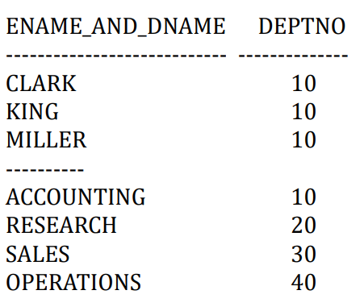

```sql
1 select ename as ename_and_dname, deptno
2   from emp
3 where deptno = 10
4   union all
5 select '----------', null
6   from t1
7   union all
8 select dname, deptno
9   from dept
```
1. 必须保证类型相同和字段数要相同
2. 如果有重复内容UNION ALL一并纳入

```sql
/* × */
select deptno
    from dept
  union all
select ename
  from emp

/* × */
select deptno, dname
    from dept
  union
select deptno
  from emp

/* 重复记录Union ALL纳入，union去掉重复行是排序删除重复行，所以大规模结果集会出现问题 */
select deptno
  from emp
  union
select deptno
  from dept

DEPTNO
---------
10
20
30
40

select distinct deptno
  from (
    select deptno
      from emp
      union all
    select deptno
      from dept
  )

DEPTNO
---------
10
20
30
40
```

### 5.5.2. 查找只存在于一张表的数据(差 -)
1. DEPT表中DEPTNO=40的数据并不存在于EMP表中，怎么把它找出来？

```sql
/* Oracle 要求类型和个数相同，不返回重复值，空值没有问题*/
1 select deptno from dept
2 minus
3 select deptno from emp

/* MySQL and SQL Server MySQL要使用子查询 */
1 select deptno
2   from dept
3 where deptno not in (select deptno from emp)

/* DB2 and PostgreSQL */
1 select deptno from dept
2 except
3 select deptno from emp

/* 如果DEPTNO不是主键 */
1 select distinct deptno
2   from dept
3 where deptno not in (select deptno from emp)
```

2. MySQL：空值not in会出现问题，同时避免in，改用exists

```sql
select deptno
  from dept
where deptno in ( 10,50, null)

DEPTNO
-------
10

select deptno
  from dept
where (deptno=10 or deptno=50 or deptno=null)

DEPTNO
-------
10

select deptno
  from dept
where deptno not in ( 10,50,null )

(no rows)

select deptno
  from dept
where not (deptno=10 or deptno=50 or deptno=null)

(no rows)


(false or false or null)
(false or null)
null
```

### 5.5.3. 从一个表检索另一个表不相关的行(外连接)
```sql
DEPTNO      DNAME             LOC
----------  ----------------- -------------
40          OPERATIONS        BOSTON


/* DB2, MySQL, PostgreSQL, SQL Server, Oracle */

1 select d.*
2   from dept d left outer join emp e
3     on (d.deptno = e.deptno)
4 where e.deptno is null

/* Oracle */
1 select d.*
2   from dept d, emp e
3 where d.deptno = e.deptno (+)
4   and e.deptno is null

select e.ename, e.deptno as emp_deptno, d.*
  from dept d left join emp e
    on (d.deptno = e.deptno)
```


### 5.5.4. 确定两个表是否有相同的数据
1. 问题：想知道两个表是否有相同的数据

```sql
create view V
  as
    select * from emp where deptno != 10
      union all
    select * from emp where ename = 'WARD'
```

2. 希望返回如下结果集


```sql
/* Oracle */
1   (
2     select empno,ename,job,mgr,hiredate,sal,comm,deptno,
3       count(*) as cnt
4       from V
5     group by empno,ename,job,mgr,hiredate,sal,comm,deptno
6     minus
7     select empno,ename,job,mgr,hiredate,sal,comm,deptno,
8       count(*) as cnt
9       from emp
10    group by empno,ename,job,mgr,hiredate,sal,comm,deptno
11  )
12  union all
13  (
14    select empno,ename,job,mgr,hiredate,sal,comm,deptno,
15      count(*) as cnt
16      from emp
17    group by empno,ename,job,mgr,hiredate,sal,comm,deptno
18    minus
19    select empno,ename,job,mgr,hiredate,sal,comm,deptno,
20      count(*) as cnt
21      from v
22    group by empno,ename,job,mgr,hiredate,sal,comm,deptno
23  )

/* MySQL and SQL Server */
1   select *
2     from (
3       select e.empno,e.ename,e.job,e.mgr,e.hiredate,
4         e.sal,e.comm,e.deptno, count(*) as cnt
5       from emp e
6       group by empno,ename,job,mgr,hiredate,
7         sal,comm,deptno
8     ) e
9   where not exists (
10  select null
11    from (
12      select v.empno,v.ename,v.job,v.mgr,v.hiredate,
13        v.sal,v.comm,v.deptno, count(*) as cnt
14      from v
15      group by empno,ename,job,mgr,hiredate,
16        sal,comm,deptno
17    ) v
18  where v.empno = e.empno
19    and v.ename = e.ename
20    and v.job = e.job
21    and v.mgr = e.mgr
22    and v.hiredate = e.hiredate
23    and v.sal = e.sal
24    and v.deptno = e.deptno
25    and v.cnt = e.cnt
26    and coalesce(v.comm,0) = coalesce(e.comm,0)
27  )
28  union all
29  select *
30    from (
31      select v.empno,v.ename,v.job,v.mgr,v.hiredate,
32        v.sal,v.comm,v.deptno, count(*) as cnt
33      from v
34      group by empno,ename,job,mgr,hiredate,
35        sal,comm,deptno
36    ) v
37  where not exists (
38    select null
39      from (
40        select e.empno,e.ename,e.job,e.mgr,e.hiredate,
41          e.sal,e.comm,e.deptno, count(*) as cnt
42        from emp e
43        group by empno,ename,job,mgr,hiredate,
44          sal,comm,deptno
45      ) e
46    where v.empno = e.empno
47      and v.ename = e.ename
48      and v.job = e.job
49      and v.mgr = e.mgr
50      and v.hiredate = e.hiredate
51      and v.sal = e.sal
52      and v.deptno = e.deptno
53      and v.cnt = e.cnt
54      and coalesce(v.comm,0) = coalesce(e.comm,0)）
```

### 5.5.5. 从多个表中返回缺失值（全外连接）
```sql
/* FULL OUTER JOIN */
1 select d.deptno,d.dname,e.ename
2   from dept d full outer join emp e
3     on (d.deptno=e.deptno)

/* union */
1 select d.deptno,d.dname,e.ename
2   from dept d right outer join emp e
3     on (d.deptno=e.deptno)
4 union
5 select d.deptno,d.dname,e.ename
6   from dept d left outer join emp e
7     on (d.deptno=e.deptno)
```

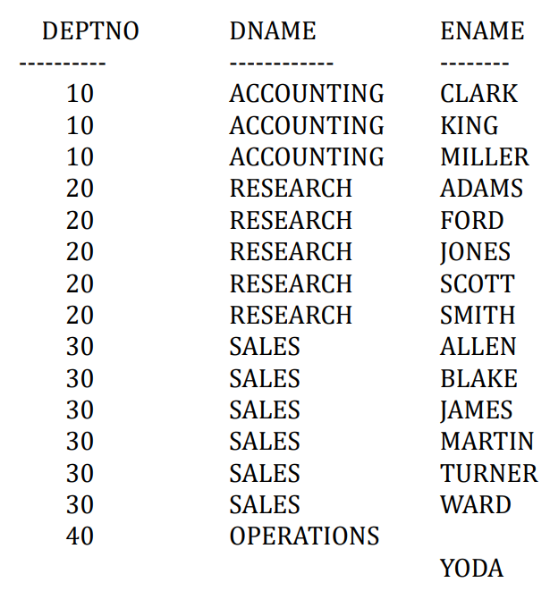

### 5.5.6. 连接和聚合函数的使用
1. 考虑新增一张bonus表，注意，存在重复记录

```sql
select * from emp_bonus
```

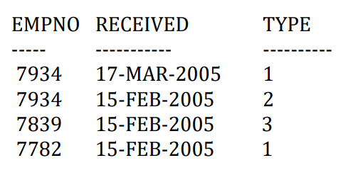

```sql
select e.empno,
  e.ename,
  e.sal,
  e.deptno,
  e.sal*case when eb.type = 1 then .1
      when eb.type = 2 then .2
      else .3
    end as bonus
  from emp e, emp_bonus eb
where e.empno = eb.empno
  and e.deptno = 10
```

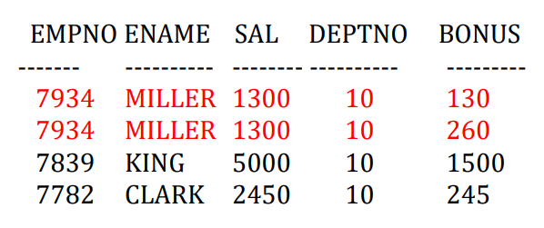

```sql
select deptno,
    sum(sal) as total_sal,
    sum(bonus) as total_bonus
  from (
    select e.empno,
      e.ename,
      e.sal,
      e.deptno,
      e.sal*case when eb.type = 1 then .1
        when eb.type = 2 then .2
        else .3
      end as bonus
  from emp e, emp_bonus eb
  where e.empno = eb.empno
    and e.deptno = 10
  ) x
group by deptno

DEPTNO   TOTAL_SAL   TOTAL_BONUS
------   ------      ------
10       10050        2135

/* 单独计算一下金额，问题？部分员工被计算了2次 */
select sum(sal) from emp where deptno=10

SUM(SAL)
----------
8750

select e.ename,
    e.sal
  from emp e, emp_bonus eb
where e.empno = eb.empno
  and e.deptno = 10

ENAME       SAL
----------  ----------
CLARK       2450
KING        5000
MILLER      1300
MILLER      1300
```

- 但是这个查询中，部门为10的所有人都有奖金

```sql
/* Perform a sum of only the DISTINCT salaries: 不得不使用distinct*/

1   select deptno,
2     sum(distinct sal) as total_sal,
3     sum(bonus) as total_bonus
4   from (
5     select e.empno,
6       e.ename,
7       e.sal,
8       e.deptno,
9       e.sal*case when eb.type = 1 then .1
10            when eb.type = 2 then .2
11            else .3
12          end as bonus
13  from emp e, emp_bonus eb
14  where e.empno = eb.empno
15  and e.deptno = 10
16  ) x
17  group by deptno
```

### 5.5.7. 思考题
1. 接4.6，修改了一个条件，不是所有员工都有奖金：少算也可能出问题
2. 请计算出部门编号为10的员工的工资总额和奖金总额

```sql
select * from emp_bonus
```


```sql
/* 错误的示范 少算 */
select deptno,
  sum(sal) as total_sal,
  sum(bonus) as total_bonus
  from (
  select e.empno,
    e.ename,
    e.sal,
    e.deptno,
    e.sal*case when eb.type = 1 then .1
      when eb.type = 2 then .2
      else .3 end as bonus
  from emp e, emp_bonus eb
  where e.empno = eb.empno
    and e.deptno = 10
  )
group by deptno

DEPTNO TOTAL_SAL TOTAL_BONUS
------ ---------- -----------
10 2600 390
```