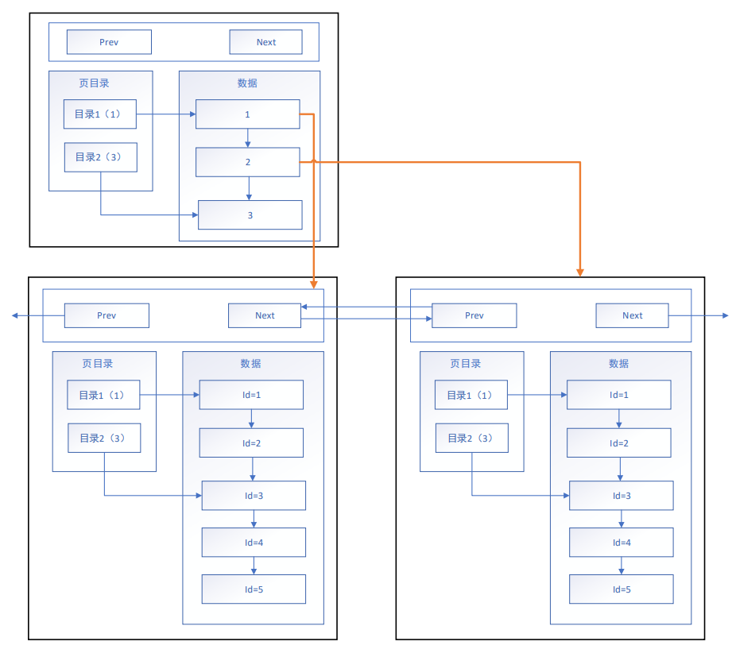
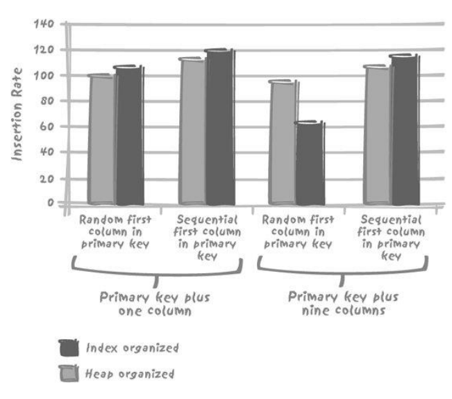

Lec5-数据库的物理存储
---
1. 下周完成SQL测试，按照测试给分
2. 我们无法比较一次操作的性能差异，我们比较时一般是针对一类查询比较很多次
3. 读的快，要聚集存储；写的快，要分散存储。
4. 关系型数据库的读写是矛盾的：写的快是很重要
5. NoSQL的数据很难保证数据一致性。

# 1. 数据表的物理实现

## 1.1. 冲突的目标
1. 并发用户数很大的系统
   1. 尽量以紧凑的方式存储数据
   2. 尽量将数据分散存储
2. 没有并发的修改密集型（change-heavy）
   1. 数据查询要快
   2. 数据更新也要快
3. DBMS所处理的基本单元（页、块）通常不可分割
4. 总结：读写不会和睦相处，怎么和谐啊~~

## 1.2. 页模式
1. 链表模式的目的是优化查询效率
2. 目录页的本质也是页，普通页中存的数据是项目数据，而目录页中存的数据是普通页的地址。

## 1.3. 把索引当成数据仓库
1. 当索引中增加额外的字段（一个或多个，它们本身与实际搜索条件无关，但包含查询所需的数据），能提高某个频繁运行的查询的速度。
2. 尽量在索引中多存储数据的极限是？--允许在主键索引中存储表中所有数据，表就是索引
   1. Oracle："索引组织表（index-organized table，IOT）"
   2. 如果有索引index(x, y)，选择select x, y仍然是可以使用索引并且很快的
   3. 如果表x, y, z，index(x, y, z)会将索引按照顺序文件存储，同时数据文件以堆文件，但是MySQL提供了以顺序文件的格式来存储。

## 1.4. 记录强制排序
1. IOT最大的优点：记录是排序的…（效率惊人）
2. 记住一点：任何有序数据便于某些处理的同时，必将对其他处理不利
   1. 表变成了树状结构……
   2. 这是失传已久的"层次型数据库"

## 1.5. 思考题
1. 程序开发中，没有银弹，任何技术都能解决一个问题，而同时带来新的问题，你能不能在你现在正在学习和使用的一些工具和技术中，总结一些他们能解决的问题，以及带来的新的问题是什么？期待你的留言。

# 2. 数据自动分组 - 分区

## 2.1. 数据自动分组（grouping）
1. 分区（partition）也是一种数据分组的方式
   1. 提高并发性（concurrency）和并行性（parallelism）：很多大型的表分成了很多的小型的表
   2. 从而增强系统架构的可伸缩性（scalable）

## 2.2. 循环分区
1. 循环分区：不受数据影响的内部机制
   1. 分区定义为各个磁盘的存储区域
   2. 可以看作是随意散布数据的机制
   3. 保持更改带来的磁盘I/O操作的平衡

## 2.3. 数据驱动分区
1. 根据一个或多个字段中的值来定义分区
   1. 一般叫分区视图（partitioned view），而MYSQL称为（merge table）
   2. 最早的分区方式：滑动窗口
   3. 自然的，我们可以使用时间进行分区，人们更倾向访问时间近的分区
2. 分区的实现方式
   1. 哈希分区（Hash-partitioning）：对分区键计算哈希值存放，不改善范围查询，负载均衡，提高并发能力
   2. 范围分区（Range-partitioning）：非常适用于处理历史数据，按照范围来存储，设置Else分区来存放其他数据
   3. 列表分区（List-partitioning）：定制特定的解决方案，某些字段经常查询或某几个字段经常一起查询，但是需要主键冗余地存储在多个分区中，保证数据完整性
3. 很多分区是可以嵌套的 比如在时间分区里构建哈希分区
4. 最常使用数据值本身作为分区，这样分区有开发的使用价值

## 2.4. 分区是把双刃剑

1. 数据分散到相对独立的分区 分区能解决并发问题吗？不能全部解决 
2. 滑动窗口按照星期分为52个分区，查询更快，每个星期的所有事物会涌入同一个分区。如果按天分区，当天查询效率确实提高了，所有的插入会针对一个更小的分区进行并发插入，甚至争夺同一个数据块，内存征用大幅提升，对并发很不利。不过数据仓库中所有的数据通过单一进程插入，没有并发的压力。
3. 订单区分地区，如果希望按时间查询就比较分散。常用方式多层分区，先按时间再按地点。
4. 又回到了IOT类似的问题："冲突"
   1. 通过分区键将数据聚集，利于高速检索
   2. 对并发执行的更改操作，分散的数据可以避免访问过于集中的问题       两个目标会彼此矛盾
   3. 如果一次性更新52个周的条目呢
   4. 数据仓库中不存在这个问题，数据仓库更新是单线程插入的
5. So，A or B……完全取决于您的需求
6. 可以使用多层分区，用不同标准在不同层处理

## 2.5. 分区与数据分布
1. 表非常大，且希望避免并发写入数据的冲突就一定要用分区吗？
2. 例如客户订单明细表 如果大部分数据来自小部分用户，那么按照用户id进行分区就意义不大。查找80%的数据时，分区查询和全表查询区别不大
3. 对分区表进行查询，当数据按分区键均匀分布时，收益最大  比如按时间均匀分布

## 2.6. 数据分区的最佳方法
1. 整体改善业务处理的操作，才是选择非缺省的存储选项的目标
2. 更新分区键会引起移动数据，似乎应该避免这么做
   1. 例如实现服务队列，类型（T1…Tn）状态（{W|P|D}）
   2. 按请求类型分区：进程的等待降低   动态调整处理某一种类型的进程数达到服务器的动态均衡提高整体运转效率，也可以避免同一种类型的大量请求淹没在系统中间。如果没有分区，轮询进程扫描队列中发现少量需要处理的，如果突发事件涌入大量同一种类型，突然爆发的类型处理速度大幅下降，因为要每种类型轮询处理，如果按照类型分区能很好地避免这种情况发生，也能发现处理压力大的进程，调动压力小的进程来达到服务器的动态平衡。
   3. 按状态分区：轮询的开销降低   缺点任何状态变化会让数据移动，更新负载提高，但是有好处，不需要轮询，按照状态W取出的都是需要处理的。有时候牺牲某种性能会让其他的性能提高，最终让整体性能提高。
   4. 取决于：服务器进程的数量、轮询频率、数据的相对流量、各类型请求的处理时间、已完成请求的移除频率
3. 对表分区有很多方法，显而易见的分区未必有效，一定要整体考虑

## 2.7. Holy Simplicity
1. 除了堆文件之外的任何存储方法，都会带来复杂性
2. 除了单库单表之外任何的存储方式，都会带来复杂性
3. 选错存储方式会带来大幅度的性能降低
4. 总结
   1. 测试，测试，测试
   2. 设计是最重要的
   3. 任何设计都有时效性