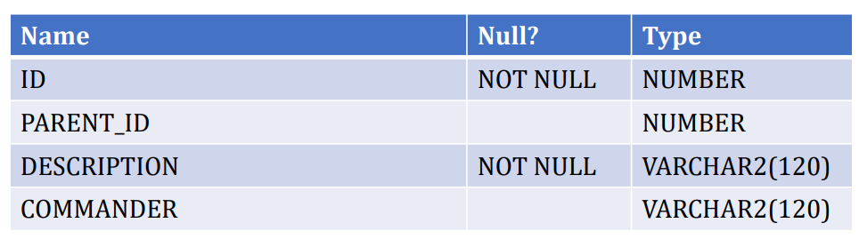
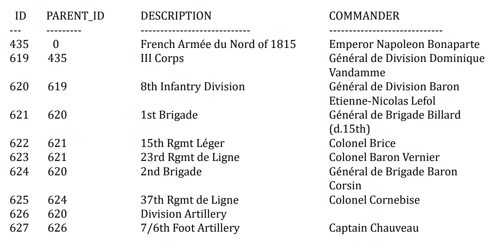
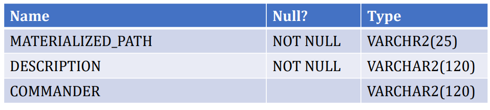
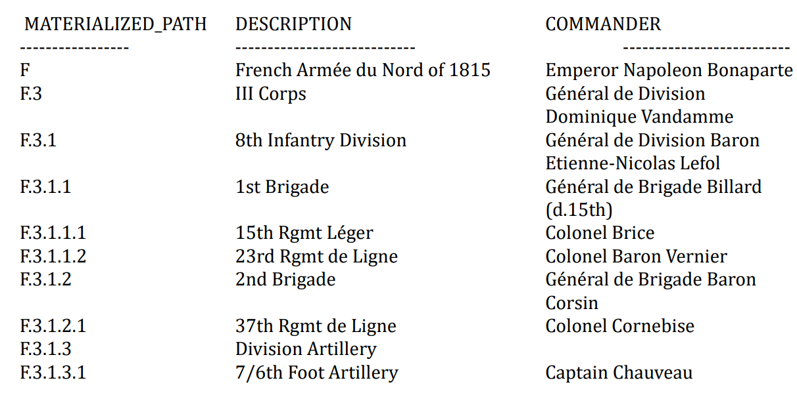
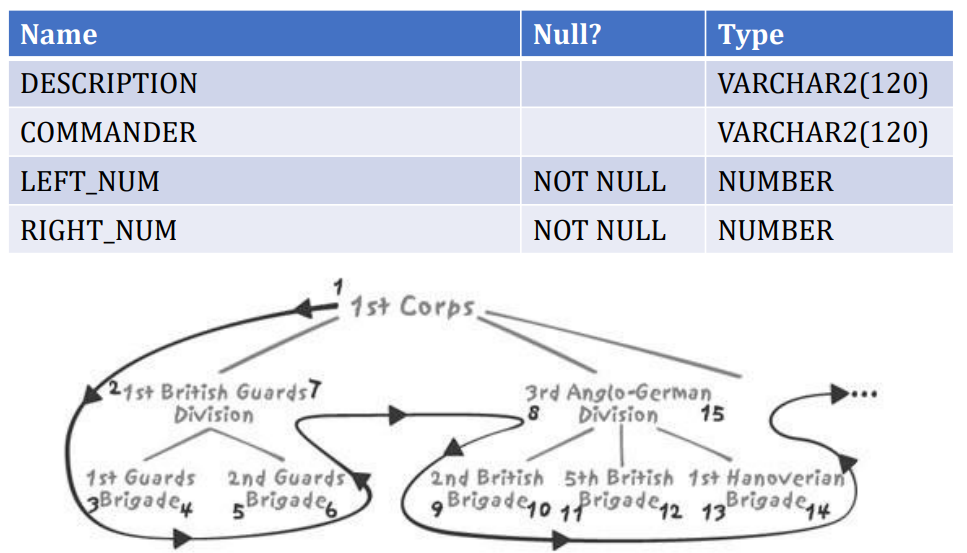
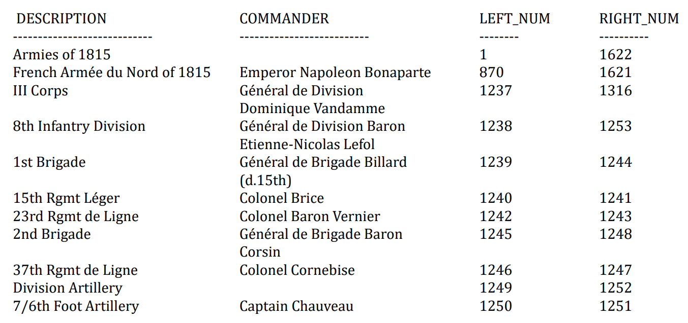

Lec6-数据库模式设计之层次结构
---

# 1. 处理层次结构（Hierarchical Data）
1. 树状结构（Tree Structures）
   1. 历史
      1. 层次数据库  嵌套 耦合性太高
      2. 网状数据库：灵活但是还是存在困难
      3. 关系型数据库
         1. 在效率、灵活等方面找到了一个平衡点
         2. 没有必要将配置文件存储到数据库中，存储在文件系统也是很好的一个选择
   2. 直到关系理论出现，数据库设计是"科学（science）"而非"工艺（craft）"
      1. 层次性数据广泛存在（XML，LDAP，BOM…）
   3. 层次结构复杂度在于
      1. 访问树的方式

# 2. 树状结构 VS. 主从结构
1. 父子结构（parent/child link）--tree structure
2. 主从结构（master/detail relationship）：通过外键，来形成主从结构
3. 差异
   1. 树状结构保存只需要一张表：代表层次的树。所有节点的类型都相同，节点的属性都相似，表(节点)和自己有主从关系而不是其他表
   2. 深度：主从结构没有深度的概念
   3. 所有权：主从结构可以明确外键完整性约束，但是树状结构不需要定义所有权
   4. 多重父节点：单一父节点描述父子关系(子节点引用父节点)，先解决单一父节点的树
4. 参考书籍：Fabian Pascal：Practical Issues in Database Management（Addion Wesley）

# 3. 层次结构的实际案例
1. Risk exposure
2. 档案位置
3. 原料使用
4. ……
5. 不同的案例具有不同的基本特征
6. 通常，树中的节点数量偏小。实际上，这也是树的优点，便于高效检索
7. 下面通过链接进行层次结构的查询，虽然要链接很多次，但每次都是唯一的id筛选，这种查询要求树的深度是个常数，但实际情况往往不是

```sql
select building.name building,
  floor.name floor,
  room.name room,
  alley.name alley,
  cabinet.name cabinet,
  shelf.name shelf,
  box.name box,
  folder.name folder
from inventory,
  location folder,
  location box,
  location shelf,
  location cabinet,
  location alley,
  location room,
  location floor,
  location building
where inventory.id = 'AZE087564609'
  and inventory.folder = folder.id
  and folder.located_in = box.id
  and box.located_in = shelf.id
  and shelf.located_in = cabinet.id
  and cabinet.located_in = alley.id
  and alley.located_in = room.id
  and room.located_in = floor.id
  and floor.located_in = building.id
```

# 4. 用SQL数据库描述树结构
1. 只要对象的类型相同，而对象的层树可变，其关系就应该被建模为树结构
2. 在数据库设计中，树通常三种模型
   1. Adjacency model 邻接模型
      1. 层次中父节点id作为子节点id的一个属性pid，不能确定兄弟节点的排序
      2. 难以处理的，是递归的
   2. Materialized path model 物化路径模型
      1. 将树中间的每一个节点和在树中的位置描述成数据的结合
      2. 是所有子节点的祖先节点的id的串联(1.2.3 父节点是1.2)
      3. 能够知道兄弟节点之间的排名，家谱  （1.2.1、1.2.2...）
   3. Nested set model 嵌套集合模型 1996
      1. 每一个节点被赋予了一对数字(left number, right number)
      2. 父节点的左数字和右数字之间包含了它所有的子节点的左数字、右数字
3. <a href = "http://www.kessler-web.co.uk">数据来源</a>

# 5. 树的实际实现

## 5.1. 邻接模型
1. ADJACENCY_MODEL



2. 表的每一行描述一个部队，parent_id指向树中的上级部队



## 5.2. 物化路径模型
1. MATERIALIZED_PATH_MODEL



2. 表中有两个索引，在materialized_path上的唯一性索引以及在commander上的索引，正确的设计应该增加id字段。



## 5.3. 嵌套集合模型
1. NESTED_SETS_MODEL





这种模型的创立者认为它优于邻接模型，因为他是基于集合的操作符合sql的特性。但有区别，sql关心的是无限集合，这个关心的是有限集合，需要知道表内有多少节点才好对leftnum和rightnum赋值。插入新节点后要重新编排所有后面的节点，基于这种表的查询和更新都是灾难（有啥用）。嵌套模型是基于指针的解决方案，而关系模型取代层次结构的目标就是逃离指针。

# 自顶向下和自底向上查询

## 自顶向下查询

### 邻接模型 

**oracle的做法：**

- connect by \<a cloumn of the current row> = prior \<a column of the previous row>  //自底向上
- connect by \<a cloumn of the previous row> = prior \<a column of the current row>  //自顶向下

字段level是每棵树的层次

lpad函数 缩排显示

不使用connect by 可以用递归的方式  起始点 union all 递归

with ... as ...

不能精准表达一个树的层次性，要重新对读取的数据排序

添加一个rank 如果是 1.0308  1代表根节点 1.03代表根节点第三个子节点 1.0308代表是第三个子节点的第八个子节点

递归在数据量很大的表上表现不好

**mysql的做法：**

- 手动union
- 在一次查询中多次连接
- 前提是已知深度

### 物化路径模型

字符串排序的问题 10.2 < 1.2.3

计算层次就是计算分隔符（点）的个数

### 嵌套集合模型

寻找后代非常简单，比较left_num或right_num

排序很难，想知道深度需要统计所有该节点和根节点之间的节点数量，三次链接

### 比较性能

返回40条记录，循环执行每个查询5000次，比较每秒返回的记录数

邻接大概100 物化路径大概50 嵌套集合大概20

物化路径模型字符串处理对性能影响大，比邻接模型只用处理数值要慢得多

嵌套集合模型，找子节点容易但想要缩排显示很难，如果树的结构不改变，而且查找子节点不需要排序，那么加一个冗余的字段记录深度，效率会非常好（维护起来非常不好）

## 自底向上查询

必然导致完整的表扫描

自底向上查询一般比自顶向下慢一点

### 邻接模型

对oracle能用connect by很容易实现

虽然快，但不能看到完整的倒装的树（非常难），会返回重复的记录

oracle不是关系操作，基于过程的

### 物化路径模型

like效率低，不能用索引，考虑列转行的操作

### 嵌套集合模型

动态计算深度依旧是问题

不要显示人造根节点 left_num>1

硬编码最大深度（为了编排显示）

### 比较性能

用单位时间内有效的记录数来衡量（排除重复记录数）

邻接模型：100

邻接模型加上处理重复数据：40

物化路径模型：20

嵌套集合模型：20

如果connect by或者with不能使用的情况下物化路径模型是一个良好的替代，最通用的最均衡的设计方案，特别是对mysql来说

## 一些问题

- 物化路径不该是key，即使他们有唯一性。因为主键最好不要更新，避免对索引的变化。路径在动态环境中会经常更新。
- 物化路径模型不需要按时兄弟节点的排序。排序不属于关系模型，只是为了编排展示。
- 所选择的编码方式不需要完全中立。把物化路径的点去掉 1.3.1->10301 不用字符串操作，用数学操作即可，只是不通用了，假设每个节点子节点不超过99个，深度不超过10。

## 思考题

尝试用mysql写成三种模型下的自顶向下和自底向上的两种查询模式的查询

对于邻接模型，查询会非常繁琐，体会一下特别是如何进行缩排

# 聚合来自树的值

## 对于保存于叶结点的值做聚合

树中往往叶结点包含更多的信息

示例：

- units表 id name commander 每一条记录一个旅、一个师或一个军的信息，不包含层次结构的信息

- unit_links_adjacency 临界模型的表，id parent_id

- unit_links_path 物化路径模型的表，id path

- unit_strength表 最底层叶结点的士兵数量, id men

计算第三军的总人数:

sum(men) from unit_strength where id in(... connect by ...)

计算每一层的人数:

对units的每一条执行上面的操作，重复计算很多，效率很低

物化路径：生成一个exploded_links_path视图，id ancestor depth，列出每个节点的所有祖先节点。将这个表和units、unit_strength表连接查询即可

性能差异：邻接模型明显慢于物化路径模型

试试用mysql编写物化路径模型的预处理视图

## 散布在各层的百分比

有些情况下三种模型存在局限性，多父节点的树状结构无法处理（这还是树吗）

例子：经营魔药，每种魔药由多种成分（ingredient）组成，处方（recipe）列出成分和百分比，会有复合成分，每种成分可以出现在多种魔药中。

比如查询龙蛋壳在5号魔药中的占比，5号魔药包含一部分龙蛋壳和9号魔药，9号魔药也包含一部分龙蛋壳，需要统计多个占比。

这类问题称为BOM问题 物料单问题

常见的设计方案：基本成分和处方构成Components，Components表为通用类型，它有recipes和basic_ingredients两种子类型。Composition表保存处方成分（可以是处方或基本成分及其数量）

用with来递归查询

## 树状结构的问题

sql确实缺乏处理树状结构的手段，在大数据量时会很慢，最好放在关系型数据库之外。

不同表结构设计在相同查询下也会性能差距很大，无法通过索引提高性能的情况下可以改变表结构设计来改变性能。

很多情况下改变表结构设计不像层次性数据存在关系表里，可以通过不同的满足三范式的表结构。通常改变表结构设计要增加冗余，也就是反范式或逆范式。