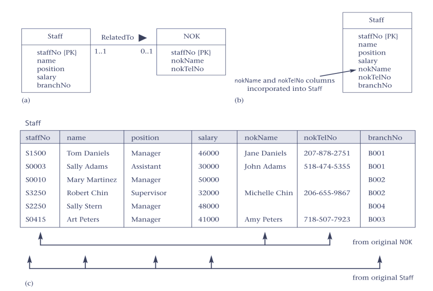
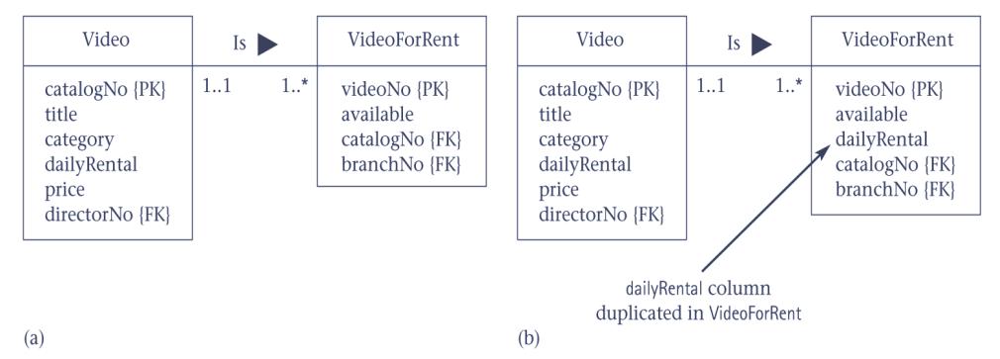
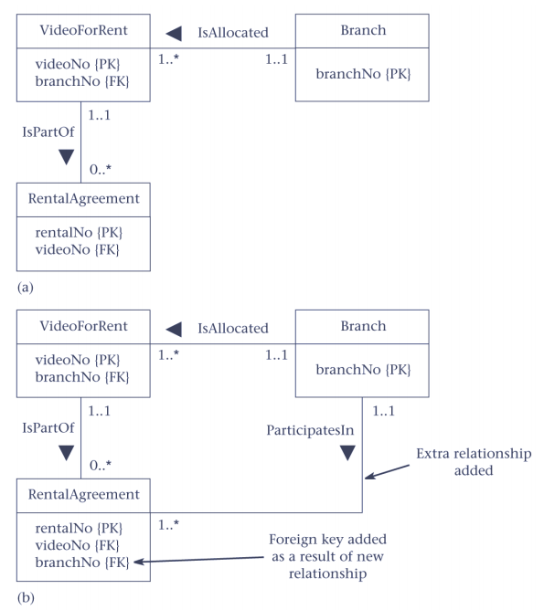
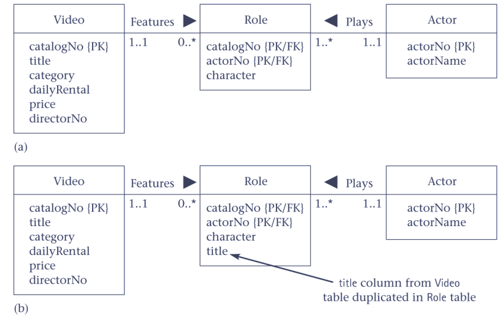

Lec7-对冗余的控制(反范式模式)
---

1. 第一范式是一个字段只有一个值：存储和使用上的要求。比如身份证号的里面的年龄不能使用(拆分字段来使用不满足第一范式)
2. 第二范式是一条记录只能被唯一主键标识
3. 第三范式是一个字段全部和一个字段是没有函数依赖，比如年龄和出生日期
4. 打破范式是为了引入可控制的冗余

# 1. Consider the Introduction of Controlled Redundancy
1. Determine whether introducing redundancy in a controlled manner by relaxing the normalization rules will improve system performance.
2. 放弃规范化，来控制冗余
3. 打破规范
   1. 规范的打破导致实现的复杂化
   2. 规范的弱化会降低灵活性
   3. 规范的弱化会让更新变慢、查找变快
4. 系统有低修改性和高查询率则选择打破规范是很好的选择。

# 2. Denormalization
1. Refinement to relational schema such that the degree of normalization for a modified table is less than the degree of at least one of the original tables.
2. Also use term more loosely to refer to situations where two tables are combined into one new table, which is still normalized but contains more nulls than original tables.

# 3. Consider the Introduction of Controlled Redundancy
1. Consider denormalization in following situations, specifically to speed up frequent or critical transactions:
   1. Pattern 1 Combining 1:1 relationships 合并一对一关系
   2. Pattern 2 Duplicating nonkey columns in 1:* relationships to reduce joins 一对多复制非关键字属性
   3. Pattern 3 Duplicating FK columns in 1:* relationships to reduce joins 一对多复制外部关键字
   4. Pattern 4 Duplicating columns in *:* relationships to reduce joins 多对多关系复制属性
   5. Pattern 5 Introducing repeating groups 引入重复组
   6. Pattern 6 Creating extract tables 合并基本表和查找表，创建提取表
   7. Pattern 7 Partitioning tables 分区
2. 逆规范化是违反三范式的
3. 先设计成三范式的 通过ER模型 再逆规范化

## 3.1. Pattern 1 Combining 1:1 relationships

一个NOK一定对应一个Staff，一个Staff可能没有NOK。 部分参与的一对一根据关系模型要设计成两张表，反范式合并成一张表。合并以全部参与的主要信息，再引入部分参与的。

1. 大量的空间浪费  如果NOK很少
2. 如果两者都是部分参与 可以合并但需要再引入主键
3. Null的问题  空间浪费和性能提高的权衡

## 3.2. Pattern 2 Duplicating nonkey columns in 1:* relationships to reduce joins

1. 可能需要触发器来同步修改属性
2. 额外注意
   1. 钱的属性一般都要打破范式存储：订单应该是实际的价格  价格可能会变化，影响之前的订单
   2. 历史价格的计算
   3. 代码表的数据复制到主表中，对不可改变的数值的反范式，无需规范，比如用户信息的国籍，主表中存储值而不是id

## 3.3. Pattern 3 Duplicating FK columns in 1:* relationship to reduce joins

1. A要访问C，需要通过B，那么可以使用这个模式来避开B表
2. 需要ER模型来发现

## 3.4. Pattern 4 Duplicating columns in \*:* relationships to reduce joins

多对多关系中加一个关系表，把多对多关系变成两个一对多关系，和第二种模式本质上是一样的

## 3.5. Pattern 5 Introducing repeating groups
1. 引入地址、电话号码    一个用户有多个地址、多个电话号码
   1. 将重复组到放到原表中：重复组数量不大、静态的、数量一致  这种方法不通用
   2. 主表中存放缺省的一个地址和电话号码，避开连接查询    大部分查询只需要缺省值，需要知道详细信息后再去表查询，在UI上要分开。

## 3.6. Pattern 6 Creating extract tables

什么查询慢就把这个查询需要的几张表全部连接成一张大表

高峰时刻访问报表，报表需要的数据来自于固定的几个表

数据可能是静态的，不能做实时计算

如果做实时计算，那就会变成物理视图，大大降低更新效率

不到必要不要使用，效率很高，但是复杂性很高，对于开发者时饮鸩止渴

1. Reports can access derived data and perform multitable joins on same set of base tables. However, data report based on may be relatively static or may not have to be current.
2. Can create a single, highly denormalized extract table based on tables required by reports, and allow users to access extract table directly instead of base tables.

## 3.7. Pattern 7 Partitioning tables

物理层面的分区，之前说过了

1. Rather than combining tables, could decompose a table into a smaller number of partitions.
2. Horizontal partition: distribute records across a number of (smaller) tables.
3. Vertical partition: distribute columns across a number of (smaller) tables. PK duplicated to allow reconstruction.
4. Partitions useful for applications that store and analyze large amounts of data.

## 需要注意的

1. 数据库需要设计成满足三范式的
2. 所有打破范式的操作都会增加更新的复杂度
3. 一旦打破范式就需要小心地控制数据的一致性和完整性（受控的冗余）

