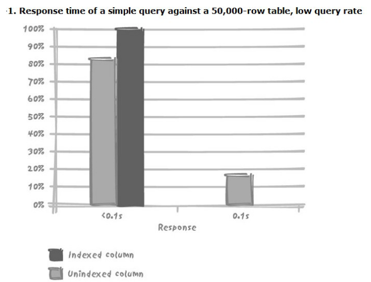
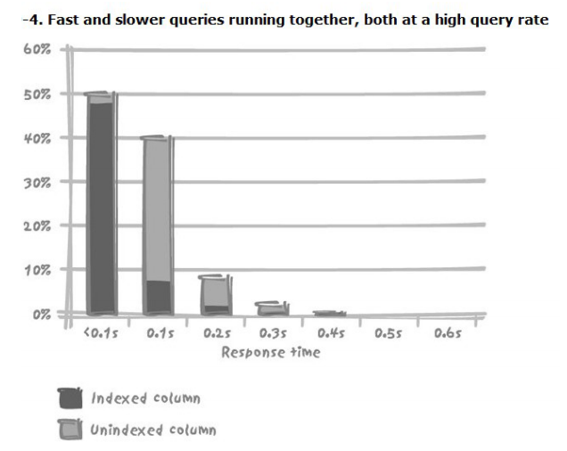
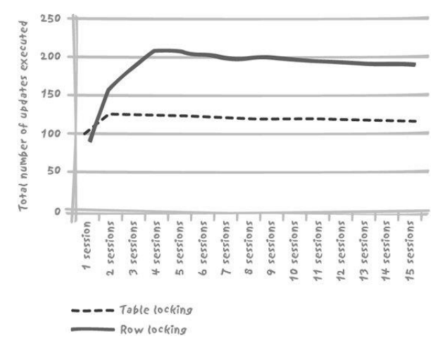
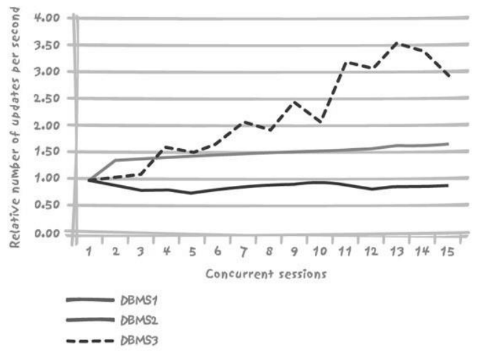
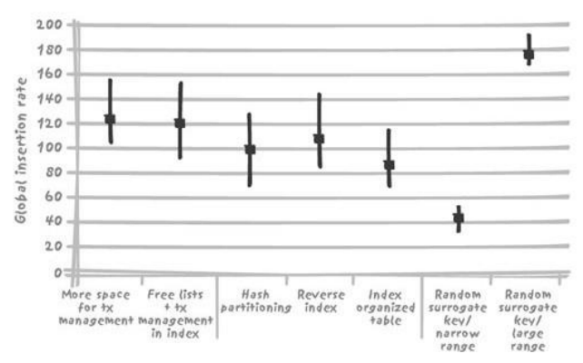

Lec8-并发处理
---

# 1. 处理并发和大数据量

## 1.1. 索引的优点
1. 一个有三个字段的表，前两个字段为整数（1-50000）第一个字段是PK，第二个字段没有索引。第三个名为label字段是字符型，长度30-50的随机字符串

```sql
/* 5000次/s */
select label
  from test_table
    where indexed_column = random value
/* 25次/s */
select label
  from test_table
    where unindexed_column = random value
```

2. 响应时间不到一秒，仍然可能隐藏着重大的性能问题，不要相信**单独某次测试**。

3. 低频率查询（500次/分钟）：有部分没有索引的列在0.1s之间



4. 高频率查询（5000次/分钟）：1s中80次请求，比较正常的速率，此时已经大部分超过0.1s，并发数在100左右


1. 超高频率查询（10000次/分钟）:**负载增加未必是造成性能问题的原因**，它只不过使性能问题暴露出来了而已，并发数在150-200左右。


## 1.2. 排队
1. 高并发会导致请求排队
2. 数据库引擎是否能快速服务
   1. 数据库引擎性能（引擎、硬件、I/O系统效率…）
   2. 数据服务的请求复杂度
   3. 快查询也会被慢查询拖累



# 2. 并发修改数据

## 2.1. 加锁
1. 锁的粒度
   1. 整个数据库、存储被修改的表的那部分物理单元、要修改的表、包含目标数据的的块和页、包含受影响数据的记录、记录中的字段
   2. 只有使用了索引才能使用到行锁(行锁是细粒度锁)：只要更新的不是一行，都可以并行执行。
   3. 尽量先比较小粒度的锁



## 2.2. 加锁处理
1. 不要随便使用表级锁
2. 尽量缩短加锁时间
   1. 事务要尽量的小
   2. Delete没有where，用truncate
3. 索引也需要维护：更新索引代价高
4. 语句性能高，未必程序性能高
   1. 尽可能避免SQL语句上的循环处理：避免将SQL在循环体中执行
   2. 尽量减少程序和数据库之间的交互次数：尽可能一次完成所有的操作(尽可能一次性查找多的数据集本地处理)
   3. 充分利用DBMS提供的机制，使跨机器交互的次数降至最少
   4. 把所有不重要不必须的SQL语句放在逻辑工作单元之外：先结束事务可以帮助更快回滚

## 2.3. 加锁与提交
1. 想要使加锁时间最短，必须频繁的提交(提交也是由代价的)
2. 但如果每个逻辑单元完成后都提交会增加大量开销
3. 数据库最大的开销是日志的记录(频繁的提交)，是否需要进行缓存之后大规模数据提交，下图横轴是每x条记录提交一次
   1. 批处理文件要减少频繁提交
   2. 其他文件可以相对频繁提交，降低回滚的影响，减少加锁的时间。 


## 2.4. 加锁与可伸缩性
1. 与表级锁相比，行级锁能产生更佳的吞吐量
2. 行级锁大都性能曲线很快达到极限
3. 但是不同的数据库产品不太一样：用来选择数据库产品的逻辑



## 2.5. 资源竞争

### 2.5.1. 插入与竞争
1. Table 是有14个字段、两个唯一性索引的表
2. 主键为系统产生的编号，而真正的键是由短字符串和日期值组成的复合键，必须满足唯一性约束(通过唯一性索引强制实施)
3. 使用随机数字段代替自增字段，避免出现问题
4. 还需要写UNDO字段，来备份RollBack，但是写日志还是有竞争的。
5. 可以更精细的设计数据库的日志文件


### 2.5.2. 解决资源竞争的方案
1. DBA解决方案：与业务逻辑弱相关或无关
   1. 事务空间（Transaction space）：调整事务锁占空间的大小，事务条目占用是重要原因，DBA可以增加分配给事务条目的空间来解决
   2. 可用列表（Free list）：insert操作在不同物理块中，可以借助存储管理手段
2. 架构解决方案
   1. 分区（Partitioning）
   2. 逆序索引（Reverse index）
   3. 索引组织表（Index organized table）：原本资源竞争包括基本表和索引，但是现在索引和基本表合并了，可以降低冲突发生的位置
3. 开发解决方案
   1. 调节并发数：限制最高的session数量
   2. 不使用系统产生键：如果键没有意义，那不妨使用随机值

### 2.5.3. 解决资源竞争的方法的案例
1. 限制insert操作之间竞争的技术
   1. DBA：不显著
   2. 架构：索引强制约束，导致索引的竞争增加，导致CPU计算资源成为瓶颈
   3. 开发者：小范围生成随机数(2倍预计)会导致多次碰撞(还有redo的消耗)，大范围生成随机数则没有这个碰撞(100倍)


2. Session数较少时竞争限制技术的表现:下图是4个session的情况：有些技术需要已处于饱和状态的CPU提供资源，所以不能带来性能上的改善



### 2.5.4. 案例总结
1. 上述案例的瓶颈是主键索引
2. 上述案例避免竞争的方法是避免使用顺序产生的代理键……
3.  总结：与加锁不同，数据库竞争是可以改善的。架构师、开发者和DBA都可以从各自的角度改善竞争。

# 3. 应付大数据量

## 3.1. 增长的数据量


## 3.2. 操作对数据量增加的敏感程度
1. 受数据量的增加，影响不大
2. 受数据量的增加，线性影响
3. 受数据量的增加，非线性影响

### 3.2.1. 影响不大
1. 主键检索等值单一查询

```sql
declare
n_id number;
cursor c is select customer_id
from orders
where order_id between 10000 and 20000;
begin
   open c;
   loop
      fetch c into n_id;
      exit when c%notfound;
   end loop;
   close c;
end;
# PL/SQL procedure successfully completed.
# Elapsed: 00:00:00.27

declare
n_id number;
begin
for i in 10000 .. 20000
loop
   select customer_id
   into n_id
   from orders
   where order_id = i;
end loop;
end;
# PL/SQL procedure successfully completed.
# Elapsed: 00:00:00.63
```

### 3.2.2. 线性影响
1. 返回记录数量和查询毫无关系：比如10万条找最大值和100万条找最大值的时间不同
2. SQL操作的数据和最后返回的结果无关（聚合函数）
3. 可选的唯一方法：引入其他条件（例如时间范围）
   1. 设定上限(完成限制)
   2. 不是单纯的技术问题
   3. 还依赖于业务需求

### 3.2.3. 非线性影响
1. 排序性能影响非线性
2. 排序性能减低间歇性
   1. 因为较小型的排序全部在内存中执行，而较大型的排序（涉及多个有序子集的合并）则需要将有序子集临时存储到硬盘中。所以通过调整分配给排序的内存数量来改善排序密集型操作的性能是常见且有效地调优技巧。

```sql
ORDERS
order_id        bigint(20) (primary key)
customer_id     bigint(20)
order_date      datetime
order_shipping  char(1)
order_comment   varchar(50)

# primary key-based search:
select order_date
from orders
where order_id = ?

# sort:
select customer_id
from orders
order by order_date

# grouping:
select customer_id, count(*)
from orders
group by customer_id
having count(*) > 3


# maximum value in a nonindexed column:
select max(order_date)
from orders

# "top 5" customers by number of orders:
select customer_id
from (select customer_id, count(*)
      from orders
      group by customer_id
      order by 2 desc) as sorted_customers
limit 5
```

6. 记录数大概从8000-1000000之间，不同的cid大概3000个


# 4. 大数据的处理逻辑

## 4.1. 综合的考量
1. 数据量增加对性能的预估
   1. 隐藏在查询背后对数据量的高敏感性
   2. 比如max()对高数据量的敏感，而直接引起子查询性能缓慢降低，必须使用非关联子查询。
2. 排序的影响:最关键的问题是排序的数据是否都在内存中(有无磁盘消耗)
   1. 字节数量而不是记录数量
   2. 也就是被排序的总数据量
   3. Join应该延后到查询的最后阶段：对尽可能少的数据进行排序
3. Join延迟到查询的最后阶段
   1. 例子：查询一年内的10大客户的名称和地址
   2. 目标，对尽量少的数据进行排序

```sql
select *
  from (select  c.customer_name,
                c.customer_address,
                c.customer_postal_code,
                c.customer_state,
                c.customer_country
                sum(d.amount)
    from customers c,
          orders_o,
          order_detail d
    where c.customer_id = o.customer_id
      and o.order_date >= some date expression
      and o.order_id = d.order_id
    group by  c.customer_name,
              c.customer_address,
              c.customer_postal_code,
              c.customer_state,
              c.customer_country
    order by 6 desc) as A
  limit 10

# 改写sql代码，在深层先完成(降低中间结果集的大小)
select  c.customer_name,
        c.customer_address,
        c.customer_postal_code,
        c.customer_state,
        c.customer_country
        b.amount
    from (select  a.customer_id,
                  a.amount
      from (select o.customer_id,
                  sum(d.amount) as amount
        from  orders_o,
              order_detail d
        where o.order_date >= some date expression
          and o.order_id = d.order_id
        group by o.customer_id
        order by 2 desc) as a
      limit 10) as b,
      customers c
  where c.customer_id = b.customer_id
  order by b.amount desc
```

## 4.2. 消除关联子查询
1. 例子：每小时以批处理的形式更新安全管理表

```sql
insert /*+ append */ into fast_scrty
  ( emplid,
    rowsecclass,
    access_cd,
    empl_rcd,
    name,
    last_name_srch,
    setid_dept,
    deptid,
    name_ac,
    per_status,
    scrty_ovrd_type)
  select distinct
    emplid,
    rowsecclass,
    access_cd,
    empl_rcd,
    name,
    last_name_srch,
    setid_dept,
    deptid,
    name_ac,
    per_status,
    'N'
  from pers_search_fast
```

```sql
# 所有的查询都是关联子查询
# 条件的可选择性差
select  a.emplid,
        sec.rowsecclass,
        sec.access_cd,
        job.empl_rcd,
        b.name,
        b.last_name_srch,
        job.setid_dept,
        job.deptid,
        b.name_ac,
        a.per_status
from  person a,
      person_name b,
      job,
      scrty_tbl_dept sec
where a.emplid = b.emplid
  and b.emplid = job.emplid
  and (job.effdt=
      ( select max(job2.effdt)
         from job job2
         where job.emplid = job2.emplid
           and job.empl-rcd = job2.empl_rcd
           and job2.effdt <=
                  to_date(to_char(sysdate,
                     'YYYY-MM-DD'),'YYYY-MM-DD'))
      and job.effseq =
            ( select max(job3.effseq)
               from job job3
               where job.emplid = job3.emplid
                  and job.empl_rcd = job3.empl_rcd
                  and job.effdt = job3.effdt ) )
  and sec.access_cd = 'Y'
  and exists
      ( select 'X'
         from treenode tn
         where tn.setid = sec.setid
           and tn.setid = job.setid_dept
           and tn.tree_name = 'DEPT_SECURITY'
           and tn.effdt = sec.tree_effdt
           and tn.tree_node = job.deptid
           and tn.tree_node_num  between sec.tree_node_num
               and sec.tree_node_num_end
           and not exists
               ( select 'X'
                  from scrty_tbl_dept sec2
                  where sec.rowsecclass = sec2.rowsecclass
                    and sec.setid = sec2.setid
                    and sec.tree_node_num <> sec2.tree_node_num
                    and tn.tree_node_num
                        between sec2.tree_node_num
                        and sec2.tree_node_num_end
                    and sec2.tree_node_num
                        between sec.tree_node_num
                        and sec.tree_node_num_end ))
```

## 4.3. 通过分区提高性能
1. 记住，单边范围条件不能充分利用索引和分区
2. 所有的更新操作中，删除（delete）最优可能造成麻烦
3. 当数据量大到一定程度，不得不进入“读写分离”的数据仓库领域